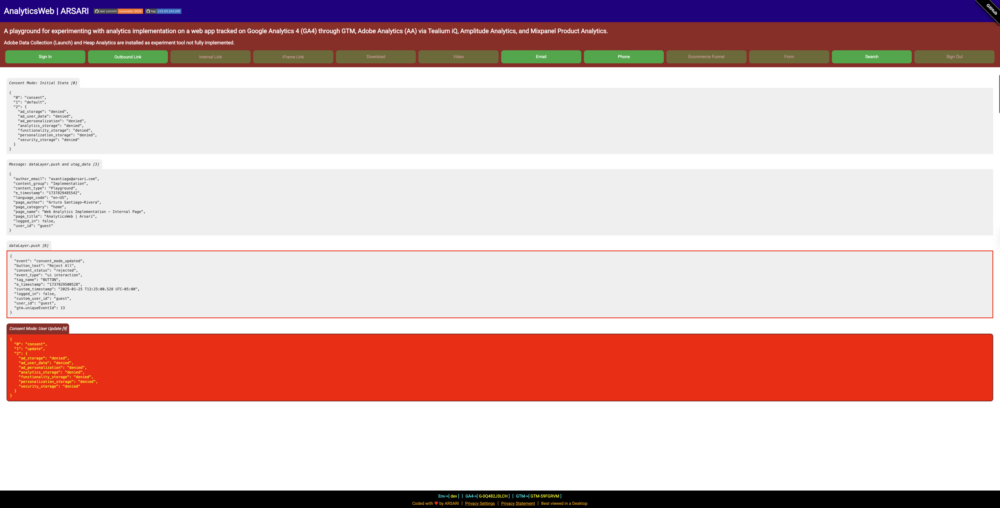
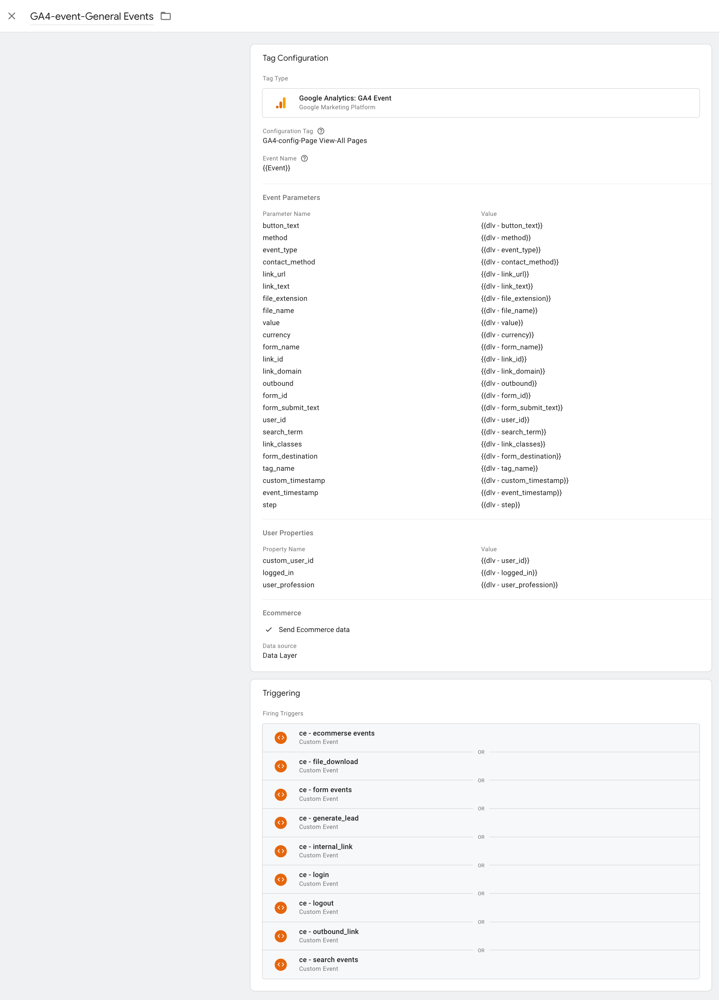
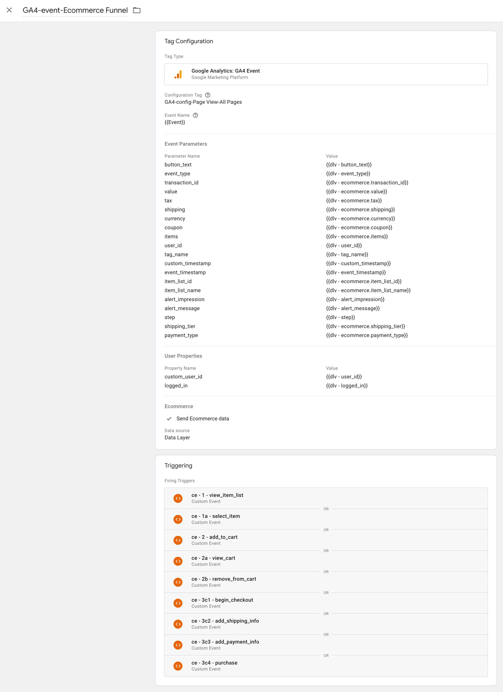
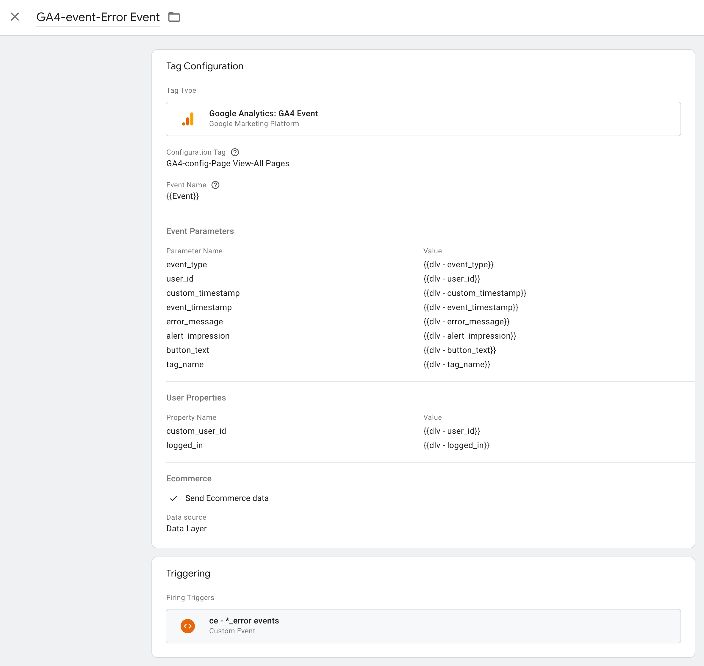

# AnalyticsWeb

[](https://www.github.com/arsari/AnalyticsWeb/tags "Go to AnalyticsWeb Releases-Tags!")&nbsp;&nbsp;&nbsp;&nbsp;[](LICENSE "Click to see License")<br>[](https://arsari.github.io/AnalyticsMobile "Click Here to Visit Repo Document!")

## Web Analytics Implementation Playground

### Table of Contents

- [AnalyticsWeb](#analyticsweb)
  - [Web Analytics Implementation Playground](#web-analytics-implementation-playground)
    - [Table of Contents](#table-of-contents)
    - [Introduction](#introduction)
    - [The Project](#the-project)
      - [Core Features](#core-features)
      - [Core Functionalities](#core-functionalities)
      - [Design and Usability](#design-and-usability)
      - [Target Audience](#target-audience)
      - [Design Philosophy](#design-philosophy)
    - [Analytic Tools Implementation and Tagging Strategy](#analytic-tools-implementation-and-tagging-strategy)
      - [Consent Mode and Page Message Definition](#consent-mode-and-page-message-definition)
      - [Events Tagging Strategy](#events-tagging-strategy)
      - [Events Groups](#events-groups)
        - [General Events](#general-events)
          - [`dataLayer.push()`](#datalayerpush)
          - [`utag.link()`](#utaglink)
          - [`amplitude.track()`](#amplitudetrack)
          - [`mixpanel.track()`](#mixpaneltrack)
        - [Ecommerce Funnel Events](#ecommerce-funnel-events)
        - [Video Events](#video-events)
        - [Error Events](#error-events)
    - [GTM Setup](#gtm-setup)
      - [General Events Tag](#general-events-tag)
      - [Ecommerce Funnel Tag](#ecommerce-funnel-tag)
      - [Error Events Tag](#error-events-tag)
      - [Video Events Tag](#video-events-tag)
    - [Reference Documentation](#reference-documentation)

### Introduction

Google Analytics 4 (GA4) and Adobe Analytics (AA) are the tools most commonly used for a comprehensive and flexible website and app analytics approach. Amplitude Analytics and Mixpanel Product Analytics allow you to answer questions, make better decisions, and drive outcomes with product analytics. For any of the aforementioned tools, to implement on our website, you will need to follow these steps:

1. Create an account or property in the corresponding analytics tool.
2. Install the tool tracking code or instrumentation on our website.
3. Verify the tool installation.
4. Configure tool reports, analysis workspace, and dashboard settings.
5. Start tracking our website traffic.

This is an exciting playground of analytic implementation for a website using GTM and a GA4 web data stream, Tealium iQ and Adobe Analytics, Amplitude Analytics, and Mixpanel Product Analytics. The implementation not only allows us to explore the following but also provides a valuable learning opportunity:

- a dataLayer array-objects managed through GTM and analyzing the data in a GA4 web data stream,
- a Tealium iQ tag management `utag_data` variable object and `utag.link()` data objects that transfer the data for analysis in Adobe Analytics.
- An Amplitude data object is used to analyze the data in Amplitude Analytics.
- a Mixpanel data object to analyze data in Mixpanel Product Analytics.
- An initial setup of Adobe Launch rules is needed to see the response in the browser console and Heap Analytics (experimental implementation). The 'Adobe Launch rules' are a set of conditions and actions that determine when and how data is collected and processed by Adobe Launch. This setup is necessary to ensure that data is collected and processed correctly for analysis in Heap Analytics.

Before we start with the playground front end and back end, it's crucial that we have a GTM container linked to the Google Analytics 4 web data stream. Additionally, we need to set up a Tealium iQ account with an AA tag, an Adobe Analytics account, an Amplitude Analytics account, and a Mixpanel Product Analytics account. Having them created and configured will ensure we're fully prepared to use the playground as a data source for the tools.

Adobe Data Collector (Launch) and Heap Analytics are included in our playground with limited implementation for experimentation. The Adobe Data Collector (Launch) is a tag management system that allows us to manage and deploy analytics and marketing tags on our website. The Heap Analytics is a product analytics tool that captures user interactions and events on our website.



### The Project

This project is not just a web analytics tool, but a comprehensive educational resource. Its comprehensive implementation facilitates tracking, event handling, and analytics integration within a web application. The scripts underpin a web analytics playground, enabling developers to implement and test various analytics events, user interactions, and data flows. The project is a valuable educational tool, providing a testing ground for implementing and experimenting with advanced web analytics tools and techniques. It integrates a variety of platforms, including:

- Google Analytics 4 (GA4)
- Google Tag Manager (GTM)
- Adobe Analytics via Tealium iQ
- Amplitude Analytics
- Mixpanel
- Heap Analytics
- Microsoft Clarity

#### Core Features

1. Dynamic Consent Management:

- A robust consent mechanism that initializes analytics preferences for storage, advertising, personalization, and security based on user consent or default settings.

2. Data Layers:

- Captures essential metadata such as author information, content grouping, timestamps, and user-related properties.
- Populates dataLayer and utag_data to enable seamless integration with various tools.

3. Analytics Initialization:

- Includes setup scripts for each platform to initialize and configure tracking, ensuring accurate data collection.

4. User Interaction Tracking:

- Supports event tracking for diverse user interactions such as form submissions, video plays, and button clicks.
- Enables funnel tracking for e-commerce activities, including product selection, checkout, and payment.

5. E-Commerce Simulation:

- Provides a multi-step e-commerce funnel with product selection, cart management, and transaction completion.
- Offers order summary and refund functionalities, making it ideal for testing purchase flows.

6. Customization and Visualization:

- Features customizable product categories and tables to simulate realistic shopping experiences.
- Displays data visualization and debugging through browser console tables and a JSON display section.

7. User Engagement:

- Incorporates a cookie consent banner and privacy options to educate users about data collection practices.

8. Interactive UI Components:

- Interactive models for search, forms, and e-commerce steps enhance user experience and testing flexibility.

#### Core Functionalities

1. Cookie Consent Management:

- Functions for showing and hiding the cookie consent banner (showBanner, hideBanner).
- Updates user consent preferences and applies them across analytics tools.

2. Dynamic Event Tracking:

- Tracks user interactions, including button clicks, form submissions, e-commerce events, and video progress.
- Automatically pushes event data to a dataLayer and third-party analytics platforms when consent allows.

3. E-Commerce Funnel Simulation:

- Tracks key stages of the e-commerce process: product selection, cart updates, checkout steps, and purchases.
- Implements discount application, shipping method selection, and payment validation.
- Generates order summaries, including itemized lists, taxes, discounts, and totals.

4. User Interaction Modals:

- Manages the visibility and functionality of interactive modals for forms, searches, and the e-commerce funnel.
- Handles input validation and provides feedback to users.

5. Error Handling:

- Displays user-friendly error messages for invalid inputs (e.g., missing fields, incorrect credit card details).
- Logs errors to analytics platforms for debugging and insights.

6. Consent and Privacy Handling:

- Integrates with a consent banner to respect user preferences for analytics and advertising data collection.
- Dynamically updates and stores consent states.

7. Analytics Platform Integration:

- Sends event data to multiple analytics platforms when user consent is granted.
- Configures and initializes tools such as Amplitude, Mixpanel, and Tealium.

8. Utility Functions:

- Includes helper functions like capitalize (capitalizes strings), timeStamp (generates ISO 8601 timestamps), and maskNumber (masks sensitive data like credit card numbers).
- Manages local storage for user session data and consent states.

9. Debugging and Visualization:

- Outputs event data and consent updates to a dedicated JSON visualization section on the webpage.
- Logs relevant metadata to the browser console for debugging.

10. Video Tracking:

- Tracks video playback status, milestones (10%, 25%, etc.), and completion events.
- Sends video progress data to analytics platforms.

#### Design and Usability

The structure is thoughtfully designed, prioritizing clarity and modularity. The following aspects stand out:

- Semantic HTML5: Provides accessibility and clarity for developers and end-users.
- External Libraries: Includes libraries like Font Awesome for UI enhancements and Google Fonts for typography.
- Responsiveness: Ensures device compatibility using viewport meta tags and adaptive design.

#### Target Audience

This project is tailored for:

- Analytics Engineers: Test analytics implementations and experiment with and validate them.
- Digital marketers: To understand data flow, analytics configuration, user behaviors, and interactions across a simulated e-commerce journey.
- Educators and learners: To explore real-world examples of analytics setup and study advanced tracking techniques and data handling.

#### Design Philosophy

This playground is not just about code; it’s a gateway to mastering web analytics implementation. Its meticulous design empowers users to simulate real-world scenarios, debug integrations, and fine-tune strategies for insightful data collection. The code is modular and extensible, making it suitable for educational and practical purposes. Its strong focus on user privacy, detailed analytics, and error handling demonstrates best practices in modern web analytics implementations, ensuring that user data is handled with the utmost care. It serves as a cornerstone for building a robust and privacy-compliant analytics environment.

### Analytic Tools Implementation and Tagging Strategy

#### Consent Mode and Page Message Definition

The implementation starts with the setup of a Google Advanced Consent Mode (Consent Mode v2) as **denied** located inside the `<head>...</head>` tag of the **home page** before any other analytic snippet. No other website page should have the Consent Mode v2 implementation. The Consent Mode v2 implementation is a crucial component of our analytics tool tagging strategy.

```html
<!--Consent Mode v2-->
<script type="text/javascript">
  window.dataLayer = window.dataLayer || [];
  function gtag() {
    window.dataLayer.push(arguments);
  }
  if (localStorage.getItem("CONSENT_MODE") === null) {
    gtag("consent", "default", {
      ad_storage: "denied",
      ad_user_data: "denied",
      ad_personalization: "denied",
      analytics_storage: "denied",
      functionality_storage: "denied",
      personalization_storage: "denied",
      security_storage: "denied",
    });
  } else {
    gtag(
      "consent",
      "default",
      JSON.parse(localStorage.getItem("CONSENT_MODE"))
    );
  }
  gtag("set", "url_passthrough", true);
  gtag("set", "ads_data_redaction", true);
</script>
<!--End Consent Mode v2-->
```

We implement consent mode in its advanced version because of the following:

1. Set default consent states. In our implementation, we ensure that our users are informed by setting consent to denied by default. While consent is denied, the Google tags send cookieless pings. Any other analytic tool tag in our implementation does not fire.
2. Wait for user interaction with the banner and update consent states. All the analytics tool tags implemented send the complete measurement data, such as page views, user interactions, and conversion events, only when a user grants consent to data collection.

The default consent mode is followed by a **message definition** with general page information that any following event will inherit. The message definition object, a crucial component, should be located inside the `<head>...</head>` tag of the web page before any analytic tool snippet. This ensures the proper functioning of our consent mode implementation. The message definition is the third `dataLayer` array-object (GTM) and `utag_data` object variable (TiQ).

```html
<!--dataLayers message-->
<script type="text/javascript">
  const userInit = localStorage.UUID ?? "guest";
  localStorage.setItem("logged", false);
  const INIT_PROPERTIES = {
    author_email: "asantiago@arsari.com",
    content_group: "Implementation",
    content_type: "Playground",
    e_timestamp: String(new Date().getTime()), // milliseconds
    language_code: "en-US",
    page_author: "Arturo Santiago-Rivera",
    page_category: "home",
    page_name: "Web Analytics Implementation - Internal Page",
    page_title: document.querySelector("title").innerText,
  };
  window.dataLayer = window.dataLayer || [];
  window.dataLayer.push({
    ...INIT_PROPERTIES,
    // user properties
    logged_in: false,
    user_id: userInit,
  });
</script>
<!--END: dataLayers message-->
```

For Tealium iQ, which use a `utag_data` variable, the message definition should be located after the opening`<body>` tag of the web page before the Tealium IQ snippet.

```html
<!-- utag data object message -->
<script type="text/javascript">
  const utag_data = {
    ...INIT_PROPERTIES,
    // user properties
    logged_in: false,
    user_id: userInit,
    custom_user_id: userInit,
  };
</script>
<!-- END: utag data object message -->
```

For Amplitude Analytics, the message definition object should be located inside the `<head>...</head>` tag of the web page **after** the Amplitude snippet but before to their statement of initialization. The initial Amplitude data object, that include events properties applicable to all the events, is coded in an enrich plugin variable.

```html
<!-- amplitude initialization -->
<script type="text/javascript">
  const enrichEventsPlugin = () => ({
    name: "enrichEventsPlugin",
    execute: async (event) => {
      event.event_properties = {
        ...event.event_properties,
        ...INIT_PROPERTIES,
      };
      return event;
    },
  });
  amplitude.add(enrichEventsPlugin()); // amplitude enrich plugin call
  amplitude.init(AMPLITUDE_KEY, userInit, {
    autocapture: { elementInteractions: false },
  }); // amplitude init statement
</script>
<!-- END: amplitude initialization -->
```

For Mixpanel Product Analytics. the message definition object should be located inside the `<head>...</head>` tag of the web page after the Mixpanel snippet and statement of initialization, and the user identify method. The message definition object is coded in a `mixpanel.register()` method. User identification and user properties are coded in `mixpanel.identify()` method and `mixpanel.people.set()` method.

```html
<!-- mixpanel initialization -->
<script type="text/javascript">
  mixpanel.init(MIXPANEL_KEY); // mixpanel init statement
  mixpanel.identify(userInit); // mixpanel user identify
  mixpanel.people.set({ logged_in: false }); // mixpanel user properties
  mixpanel.register({
    ...INIT_PROPERTIES,
  });
  mixpanel.track_pageview({
    e_timestamp: String(new Date().getTime()), // milliseconds
  });
</script>
<!-- END: mixpanel initialization -->
```

Immediately after the message definition, a consent banner is displayed to capture the user consent to enable the tracking tools. The banner allows the user to set the consent mode as `granted` for all the consent types or their specific selection. The consent mode is stored in the local storage as `CONSENT_MODE` variable and is used to determine the user consent status for the analytics tools. It ensures that the user is informed about the data collection practices and allows them to grant or deny consent for data collection. The consent mode is set to `granted` when the user clicks the `Accept` button on the consent banner. The consent mode is set to `denied` when the user clicks the `Reject` button on the consent banner.

Consent types include:

| Consent Type            | Description                                                                                                             |
| ----------------------- | ----------------------------------------------------------------------------------------------------------------------- |
| ad_storage              | Enables storage, such as cookies (web) or device identifiers (apps), related to advertising.                            |
| ad_user_data            | Sets consent for sending user data to Google for online advertising purposes.                                           |
| ad_personalization      | Sets consent for personalized advertising.                                                                              |
| analytics_storage       | Enables storage, such as cookies (web) or device identifiers (apps), related to analytics, for example, visit duration. |
| functionality_storage   | Enables storage that supports the functionality of the website or app, for example, language settings                   |
| personalization_storage | Enables storage related to personalization, for example, video recommendations                                          |
| security_storage        | Enables storage related to security such as authentication functionality, fraud prevention, and other user protection   |

#### Events Tagging Strategy

The implementation for tagging events consider the followings user actions (ui interactions), system events (content tools), and errors based on an element click attribute `[name="action"]` and a `addEventListener()` method to fire the corresponding **events**:

| User Action          | Event Name                  | Type             | Parameters/Event Properties                                                                                                                                                | GA4 Scope                                                            | GA4 Custom Definitions                                                                                       |
| -------------------- | --------------------------- | ---------------- | -------------------------------------------------------------------------------------------------------------------------------------------------------------------------- | -------------------------------------------------------------------- | ------------------------------------------------------------------------------------------------------------ |
| Sign In              | login                       | user interaction | method                                                                                                                                                                     | Event                                                                | Predefined                                                                                                   |
| Outbound Link        | outbound_link               | user interaction | link_domain<br>link_classes<br>link_id<br>link_url<br>link_text<br>outbound                                                                                                | Event<br>Event<br>Event<br>Event<br>Event<br>Event                   | Predefined<br>Predefined<br>Predefined<br>Predefined<br>Predefined<br>Predefined                             |
| Internal Link        | internal_link               | user interaction | link_domain<br>link_classes<br>link_id<br>link_url<br>link_text                                                                                                            | Event<br>Event<br>Event<br>Event<br>Event                            | Predefined<br>Predefined<br>Predefined<br>Predefined<br>Predefined                                           |
| Download             | file_download               | user interaction | file_name<br>file_extension<br>link_domain<br>link_classes<br>link_id<br>link_text                                                                                         | Event<br>Event<br>Event<br>Event<br>Event<br>Event                   | Predefined<br>Predefined<br>Predefined<br>Predefined<br>Predefined<br>Predefined                             |
| Video                | video_start                 | user interaction | video_duration<br>video_current_time<br>video_percent<br>video_status<br>video_provider<br>video_title<br>video_url                                                        | Event<br>Event<br>Event<br>Event<br>Event<br>Event<br>Event          | Metric (sec)<br>Metric (sec)<br>Dimension<br>Dimension<br>Predefined<br>Predefined<br>Predefined             |
| Video Playing        | video_progress              | content tool     | video_duration<br>video_current_time<br>video_percent<br>video_status<br>video_provider<br>video_title<br>video_url                                                        | Event<br>Event<br>Event<br>Event<br>Event<br>Event<br>Event          | Metric (sec)<br>Metric (sec)<br>Dimension<br>Dimension<br>Predefined<br>Predefined<br>Predefined             |
| Video Playing        | video_complete              | content tool     | video_duration<br>video_current_time<br>video_percent<br>video_status<br>video_provider<br>video_title<br>video_url                                                        | Event<br>Event<br>Event<br>Event<br>Event<br>Event<br>Event          | Metric (sec)<br>Metric (sec)<br>Dimension<br>Dimension<br>Predefined<br>Predefined<br>Predefined             |
| Video playing        | video_stop                  | user interaction | video_duration<br>video_current_time<br>video_percent<br>video_status<br>video_provider<br>video_title<br>video_url                                                        | Event<br>Event<br>Event<br>Event<br>Event<br>Event<br>Event          | Metric (sec)<br>Metric (sec)<br>Dimension<br>Dimension<br>Predefined<br>Predefined<br>Predefined             |
| Email                | generate_lead               | user interaction | contact_method<br>currency<br>value                                                                                                                                        | Event<br>Event<br>Event                                              | Dimension<br>Predefined<br>Predefined                                                                        |
| Phone                | generate_lead               | user interaction | contact_method<br>currency<br>value                                                                                                                                        | Event<br>Event<br>Event                                              | Dimension<br>Predefined<br>Predefined                                                                        |
| Form                 | form_start                  | user interaction | form_destination<br>form_id<br>form_name                                                                                                                                   | Event<br>Event<br>Event                                              | Dimension<br>Dimension<br>Dimension                                                                          |
| \* _Submit Button_   | form_submit                 | user interaction | contact_method<br>form_destination<br>form_id<br>form_name<br>form_submit_text<br>value<br>user_profession                                                                 | Event<br>Event<br>Event<br>Event<br>Event<br>Event<br>Event          | Dimension<br>Dimension<br>Dimension<br>Dimension<br>Dimension<br>Predefined<br>Dimension                     |
| \* Close             | form_modal_closed           | user interaction | form_id<br>form_name                                                                                                                                                       | Event<br>Event                                                       | Dimension<br>Dimension                                                                                       |
| Form                 | form_error                  | content tool     | error_message<br>alert_impression                                                                                                                                          | Event<br>Event                                                       | Dimension<br>Dimension                                                                                       |
| Ecommerce Funnel     | ecommerce_modal_opened      | user interaction |                                                                                                                                                                            |                                                                      |                                                                                                              |
| Ecommerce Funnel     | view_item_list              | content tool     | ecommerce.item_list_id<br>ecommerce.item_list_name<br>ecommerce.items                                                                                                      | Event<br>Event<br>Event                                              | Predefined<br>Predefined<br>Predefined                                                                       |
| Ecommerce Funnel     | select_item                 | user interaction | ecommerce.item_list_id<br>ecommerce.item_list_name<br>ecommerce.items                                                                                                      | Event<br>Event<br>Event                                              | Predefined<br>Predefined<br>Predefined                                                                       |
| Ecommerce Funnel     | add_to_cart                 | user interaction | ecommerce.currency<br>ecommerce.value<br>ecommerce.items                                                                                                                   | Event<br>Event<br>Event                                              | Predifined<br>Predifined<br>Predifined                                                                       |
| Ecommerce Funnel     | view_cart                   | content tool     | ecommerce.currency<br>ecommerce.value<br>ecommerce.items                                                                                                                   | Event<br>Event<br>Event                                              | Predifined<br>Predifined<br>Predifined                                                                       |
| Ecommerce Funnel     | remove_from_cart            | user interaction | alert_message<br>alert_impression<br>ecommerce.currency<br>ecommerce.value<br>ecommerce.items                                                                              | Event<br>Event<br>Event<br>Event<br>Event                            | Dimension<br>Dimension<br>Predifined<br>Predifined<br>Predifined                                             |
| Ecommerce Funnel     | begin_checkout              | user interaction | ecommerce.currency<br>ecommerce.value<br>ecommerce.coupon<br>ecommerce.items                                                                                               | Event<br>Event<br>Event<br>Event                                     | Predifined<br>Predifined<br>Predifined<br>Predifined                                                         |
| Ecommerce Funnel     | add_shipping_info           | user interaction | ecommerce.currency<br>ecommerce.value<br>ecommerce.coupon<br>ecommerce.shipping_tier<br>ecommerce.items                                                                    | Event<br>Event<br>Event<br>Event<br>Event                            | Predifined<br>Predifined<br>Predifined<br>Predifined<br>Predifined                                           |
| Ecommerce Funnel     | add_payment_info            | user interaction | ecommerce.currency<br>ecommerce.value<br>ecommerce.coupon<br>ecommerce.payment_type<br>ecommerce.items                                                                     | Event<br>Event<br>Event<br>Event<br>Event                            | Predifined<br>Predifined<br>Predifined<br>Predifined<br>Predifined                                           |
| Ecommerce Funnel     | purchase                    | user interaction | ecommerce.transaction_id<br>ecommerce.currency<br>ecommerce.value<br>ecommerce.tax<br>ecommerce.shipping<br>ecommerce.coupon<br>ecommerce.shipping_tier<br>ecommerce.items | Event<br>Event<br>Event<br>Event<br>Event<br>Event<br>Event<br>Event | Predifined<br>Predifined<br>Predifined<br>Predifined<br>Predifined<br>Predifined<br>Predifined<br>Predifined |
| Ecommerce Funnel     | refund                      | user interaction | ecommerce.transaction_id<br>ecommerce.currency<br>ecommerce.value<br>ecommerce.tax<br>ecommerce.shipping<br>ecommerce.coupon<br>ecommerce.items                            | Event<br>Event<br>Event<br>Event<br>Event<br>Event<br>Event          | Predifined<br>Predifined<br>Predifined<br>Predifined<br>Predifined<br>Predifined<br>Predifined               |
| Ecommerce Funnel     | \<ecommerce events\>\_error | content tool     | error_message<br>alert_impression<br>step                                                                                                                                  | Event<br>Event<br>Event                                              | Dimension<br>Dimension<br>Dimension                                                                          |
| \* Cancel            | ecommerce_modal_closed      | user interaction |                                                                                                                                                                            |                                                                      |                                                                                                              |
| Search               | search_modal_opened         | user interaction |                                                                                                                                                                            |                                                                      |                                                                                                              |
| \* _Magnified Glass_ | search                      | user interaction | search_term                                                                                                                                                                | Event                                                                | Predefined                                                                                                   |
| \* Close             | search_modal_closed         | user interaction |                                                                                                                                                                            |                                                                      |                                                                                                              |
| Search               | search_error                | content tool     | error_message<br>alert_impression                                                                                                                                          | Event<br>Event                                                       | Dimension<br>Dimension                                                                                       |
| Sign Out             | logout                      | user interaction |                                                                                                                                                                            | Event                                                                | Dimension                                                                                                    |

The following global parameters/event properties apply to most of the above **events**:

| Global Parameters/Event Properties      | GA4 Scope | GA4 Custom Definitions |
| --------------------------------------- | --------- | ---------------------- |
| event_id (gtm config parameter)         | Event     | Dimension              |
| event_type                              | Event     | Dimension              |
| button_text                             | Event     | Dimension              |
| tag_name                                | Event     | Dimension              |
| env_viewed (amplitude & mixpanel)       | n/a       | n/a                    |
| step (ecommerce events only)            | Event     | Dimension              |
| section_heading (ecommerce events only) | Event     | Dimension              |
| e_timestamp (milliseconds)              | Event     | Dimension              |
| custom_timestamp (ISO 8601)             | Event     | Dimension              |
| custom_user_id (user Property)          | User      | Dimension              |
| logged_in (user property)               | User      | Dimension              |
| user_id (user property)                 | User      | Predefined             |

> On Amplitude Analytics, the event name is modified in the events list of the Amplitude dashboard as noun+verb capitalizing each word. The event properties naming is sneak_case.

We classified the events implemented into the following event groups:

- [General Events](#general-events)
- [Ecommerce Funnel Events](#ecommerce-funnel-events)
- [Video Events](#video-events)
- [Error Events](#error-events)

The events `dataLayer` array-object is based on [Google Analytics 4](https://support.google.com/analytics/answer/9322688?hl=en) events recommendations and [Google Tag Manager dataLayer](https://developers.google.com/tag-manager/devguide#datalayer). The `utag.link` data object is based on the [Tealium utag.link](https://community.tealiumiq.com/t5/Tealium-iQ-Tag-Management/utag-link-Reference/ta-p/1009) and [Adobe Analytics](https://marketing.adobe.com/resources/help/en_US/sc/implement/link-tracking.html) objects. The Amplitude Analytics data object is based on the Amplitude source [Browser SDK 2.0](https://www.docs.developers.amplitude.com/data/sdks/browser-2/). The Mixpanel Product Analytics data object is based on the Mixpanel source [Mixpanel JavaScript Library](https://developer.mixpanel.com/docs/javascript).

#### Events Groups

##### General Events

The implemented _general events_ `dataLayer` array-object, `utag.link` data object, and `amplitude.track` data object is composed of:

###### `dataLayer.push()`

```js
window.dataLayer = window.dataLayer || [];
window.dataLayer.push({
  event: en || e.id,
  // event parameters
  button_text:
    e.tagName === "BUTTON" && e.innerText !== "" ? e.innerText : undefined,
  contact_method: cm,
  currency: cc,
  event_type: /generate_lead|form_submit/.test(en)
    ? "conversion"
    : "ui interaction",
  file_extension: e.id === "download" ? "pdf" : undefined,
  file_name: e.id === "download" ? "PDF_to_Download" : undefined,
  form_destination: fd,
  form_id: e.id.includes("form") ? e.id : undefined,
  form_name: e.id.includes("form") ? "User Profession Survey" : undefined,
  form_submit_text: e.id === "form" ? e.innerText : undefined,
  link_domain: ld,
  link_classes: lc,
  link_id: /extlink|intlink|download|banner/.test(e.id) ? e.id : undefined,
  link_url: lu,
  link_text: /extlink|intlink|download|banner/.test(e.id)
    ? e.innerText
    : undefined,
  method: e.id === "login" ? "Google" : undefined,
  outbound: ol,
  search_term: st,
  tag_name: e.tagName,
  value: ev,
  video_duration:
    e.id.includes("video") && (vplay === true || vstop === true)
      ? vd
      : undefined,
  video_current_time:
    e.id.includes("video") && (vplay === true || vstop === true)
      ? vct
      : undefined,
  video_percent:
    e.id.includes("video") && (vplay === true || vstop === true)
      ? vpct
      : undefined,
  video_status:
    e.id.includes("video") && (vplay === true || vstop === true)
      ? vs
      : undefined,
  video_provider:
    e.id.includes("video") && (vplay === true || vstop === true)
      ? vp
      : undefined,
  video_title:
    e.id.includes("video") && (vplay === true || vstop === true)
      ? vt
      : undefined,
  video_url:
    e.id.includes("video") && (vplay === true || vstop === true)
      ? vu
      : undefined,
  e_timestamp: tstamp, // milliseconds
  custom_timestamp: cstamp, // ISO 8601
  // user properties
  logged_in: logged,
  user_id: ui,
  user_profession: up,
});
```

###### `utag.link()`

```js
utag.link({
  tealium_event: en || e.id,
  // event parameters
  button_text:
    e.tagName === "BUTTON" && e.innerText !== "" ? e.innerText : undefined,
  contact_method: cm,
  currency: cc,
  event_type: /generate_lead|form_submit/.test(en)
    ? "conversion"
    : "ui interaction",
  file_extension: e.id === "download" ? "pdf" : undefined,
  file_name: e.id === "download" ? "PDF_to_Download" : undefined,
  form_destination: fd,
  form_id: e.id.includes("form") ? e.id : undefined,
  form_name: e.id.includes("form") ? "User Profession Survey" : undefined,
  form_submit_text: e.id === "form" ? e.innerText : undefined,
  link_domain: ld,
  link_classes: lc,
  link_id: /extlink|intlink|download|banner/.test(e.id) ? e.id : undefined,
  link_url: lu,
  link_text: /extlink|intlink|download|banner/.test(e.id)
    ? e.innerText
    : undefined,
  method: e.id === "login" ? "Google" : undefined,
  outbound: ol,
  search_term: st,
  tag_name: e.tagName,
  value: ev,
  video_duration:
    e.id.includes("video") && (vplay === true || vstop === true)
      ? vd
      : undefined,
  video_current_time:
    e.id.includes("video") && (vplay === true || vstop === true)
      ? vct
      : undefined,
  video_percent:
    e.id.includes("video") && (vplay === true || vstop === true)
      ? vpct
      : undefined,
  video_status:
    e.id.includes("video") && (vplay === true || vstop === true)
      ? vs
      : undefined,
  video_provider:
    e.id.includes("video") && (vplay === true || vstop === true)
      ? vp
      : undefined,
  video_title:
    e.id.includes("video") && (vplay === true || vstop === true)
      ? vt
      : undefined,
  video_url:
    e.id.includes("video") && (vplay === true || vstop === true)
      ? vu
      : undefined,
  e_timestamp: tstamp, // milliseconds
  custom_timestamp: cstamp, // ISO 8601
  // user properties
  custom_user_id: ui,
  logged_in: logged,
  user_id: ui,
  user_profession: up,
});
```

###### `amplitude.track()`

```js
amplitude.setUserId(ui);
amplitude.track({
  event_type: en || e.id,
  event_properties: {
    button_text: bt,
    contact_method: cm,
    currency: cc,
    event_type: /generate_lead|form_submit/i.test(en)
      ? "conversion"
      : "ui interaction",
    tag_name: e.tagName,
    file_extension: e.id === "download" ? "pdf" : undefined,
    file_name: e.id === "download" ? "PDF_to_Download" : undefined,
    form_destination: fd,
    form_id: e.id.includes("form") ? e.id : undefined,
    form_name: e.id.includes("form") ? "User Profession Survey" : undefined,
    form_submit_text: e.id === "form" ? fst : undefined,
    link_domain: ld,
    link_classes: lc,
    link_id: /extlink|intlink|download|banner/i.test(e.id) ? e.id : undefined,
    link_url: lu,
    link_text: /extlink|intlink|download|banner/i.test(e.id) ? bt : undefined,
    method: e.id === "login" ? "Google" : undefined,
    outbound: ol,
    search_term: st,
    value: ev,
    video_duration:
      e.id.includes("video") && (vplay === true || vstop === true)
        ? vd
        : undefined,
    video_current_time:
      e.id.includes("video") && (vplay === true || vstop === true)
        ? vct
        : undefined,
    video_percent:
      e.id.includes("video") && (vplay === true || vstop === true)
        ? vpct
        : undefined,
    video_status:
      e.id.includes("video") && (vplay === true || vstop === true)
        ? vs
        : undefined,
    video_provider:
      e.id.includes("video") && (vplay === true || vstop === true)
        ? vp
        : undefined,
    video_title:
      e.id.includes("video") && (vplay === true || vstop === true)
        ? vt
        : undefined,
    video_url:
      e.id.includes("video") && (vplay === true || vstop === true)
        ? vu
        : undefined,
    e_timestamp: tstamp, // milliseconds
    custom_timestamp: cstamp, // ISO 8601
  },
  user_properties: {
    $set: {
      custom_user_id: ui,
      logged_in: logged,
      user_profession: up,
    },
  },
});
```

###### `mixpanel.track()`

```js
mixpanel.identify(ui);
mixpanel.people.set({
  custom_user_id: ui,
  logged_in: logged,
  user_profession: up,
});
mixpanel.track(en || e.id, {
  button_text: bt,
  contact_method: cm,
  currency: cc,
  event_type: /generate_lead|form_submit/i.test(en)
    ? "conversion"
    : "ui interaction",
  tag_name: e.tagName,
  file_extension: e.id === "download" ? "pdf" : undefined,
  file_name: e.id === "download" ? "PDF_to_Download" : undefined,
  form_destination: fd,
  form_id: e.id.includes("form") ? e.id : undefined,
  form_name: e.id.includes("form") ? "User Profession Survey" : undefined,
  form_submit_text: e.id === "form" ? fst : undefined,
  link_domain: ld,
  link_classes: lc,
  link_id: /extlink|intlink|download|banner/i.test(e.id) ? e.id : undefined,
  link_url: lu,
  link_text: /extlink|intlink|download|banner/i.test(e.id) ? bt : undefined,
  method: e.id === "login" ? "Google" : undefined,
  outbound: ol,
  search_term: st,
  value: ev,
  video_duration:
    e.id.includes("video") && (vplay === true || vstop === true)
      ? vd
      : undefined,
  video_current_time:
    e.id.includes("video") && (vplay === true || vstop === true)
      ? vct
      : undefined,
  video_percent:
    e.id.includes("video") && (vplay === true || vstop === true)
      ? vpct
      : undefined,
  video_status:
    e.id.includes("video") && (vplay === true || vstop === true)
      ? vs
      : undefined,
  video_provider:
    e.id.includes("video") && (vplay === true || vstop === true)
      ? vp
      : undefined,
  video_title:
    e.id.includes("video") && (vplay === true || vstop === true)
      ? vt
      : undefined,
  video_url:
    e.id.includes("video") && (vplay === true || vstop === true)
      ? vu
      : undefined,
  e_timestamp: tstamp, // milliseconds
  custom_timestamp: cstamp, // ISO 8601
});
```

##### Ecommerce Funnel Events

We have set up the _ecommerce funnel events_ in way that collect information about the shopping behavior of the users. The approach for this was based on the [Google Measure Ecommerce|https://developers.google.com/analytics/devguides/collection/ga4/ecommerce?client_type=gtm] guide in the Google Analytics 4 documentation.

**The items array-object**

The following is an example of a collection of items, `items` array-object, that we are using in our implementation. The items array can include up to 200 elements.

```js
const productList = [
  {
    item_name: "Stan and Friends Tee",
    affiliation: "Merchandise Store",
    item_brand: "MyCollection",
    item_category: "Apparel",
    item_category2: "Adult",
    item_category3: "Shirts",
    item_category4: "Crew",
    item_category5: "Short sleeve",
    item_list_id: "related_products",
    item_list_name: "Related Products",
    item_variant: "green",
    location_id: "ChIJIQBpAG2ahYAR_6128GcTUEo",
    price: 29.95,
  },
  {
    item_name: "Friends Pants",
    affiliation: "Merchandise Store",
    item_brand: "MyCollection",
    item_category: "Apparel",
    item_category2: "Adult",
    item_category3: "Pants",
    item_category4: "Crew",
    item_category5: "Regular Fit",
    item_list_id: "related_products",
    item_list_name: "Related Products",
    item_variant: "blue",
    location_id: "ChIJIQBpAG2ahYAR_6128GcTUEo",
    price: 39.95,
  },
  {
    item_name: "Canyonlands Full-Zip Hoodie",
    affiliation: "Merchandise Store",
    item_brand: "MyCollection",
    item_category: "Apparel",
    item_category2: "Adult",
    item_category3: "Jackets",
    item_category4: "Crew",
    item_category5: "Long sleeve",
    item_list_id: "related_products",
    item_list_name: "Related Products",
    item_variant: "black",
    location_id: "ChIJIQBpAG2ahYAR_6128GcTUEo",
    price: 99.0,
  },
];
```

When the user complete the ecommerce funnel by placing a purchase and firing the purchase event with one or more items defined with the relevant fields, the `items` array-object could look like this:

```js
{
  items: [
    {
      item_id: "SKU_12345",
      item_name: "Canyonlands Full-Zip Hoodie",
      affiliation: "Merchandise Store",
      coupon: "SUMMER_FUN",
      discount: 9.9,
      index: 0,
      item_brand: "MyCollection",
      item_category: "Apparel",
      item_category2: "Adult",
      item_category3: "Jackets",
      item_category4: "Crew",
      item_category5: "Long sleeve",
      item_list_id: "related_products",
      item_list_name: "Related Products",
      item_variant: "black",
      location_id: "ChIJIQBpAG2ahYAR_6128GcTUEo",
      price: 99.0,
      quantity: 1,
    },
  ];
}
```

**Clear the ecommerce object**

It's recommended that we use the following command to clear the ecommerce object prior to pushing an ecommerce event to the data layer. Clearing the object will prevent multiple ecommerce events on a page from affecting each other. The ecommerce object clearance only applies to the GA4 data layer and Tealium data layer.

```js
window.dataLayer = window.dataLayer || [];
window.dataLayer.push({
  ecommerce: null,
}); // Clear the previous ecommerce object
utag.link({
  ecommerce: null,
}); // Clear the previous ecommerce object
```

**Ecommerce events**

For most of the _ecommerce funnel events_ the implemented `dataLayer` array-object and `utag.link` data object is composed of:

```js
window.dataLayer = window.dataLayer || [];
window.dataLayer.push({
  event: en,
  // event parameters
  button_text: bt,
  event_type: et,
  tag_name: e.tagName,
  step: step.at(-1),
  ecommerce:
    en === "ecommerce_modal_closed" || en === "ecommerce_funnel_complete"
      ? undefined
      : {
          transaction_id: transactionID ?? undefined,
          value: itemsValue === 0 ? undefined : itemsValue.tofixed(2),
          tax: tax === 0 ? undefined : tax,
          shipping: shipping === 0 ? undefined : shipping,
          currency: itemsValue === 0 ? undefined : "USD",
          coupon: userCoupon ?? undefined,
          shipping_tier: userShipping ?? undefined,
          payment_type: userCCBrand ?? undefined,
          item_list_id: /productList/i.test(e.id)
            ? tempList[0].item_list_id
            : undefined,
          item_list_name: /productList/i.test(e.id)
            ? tempList[0].item_list_name
            : undefined,
          items: /productList/i.test(e.id) ? tempList : itemsSelected,
        },
  e_timestamp: tstamp, // milliseconds
  custom_timestamp: cstamp, // ISO 8601
  // user properties
  logged_in: logged,
  user_id: ui,
});

utag.link({
  tealium_event: en,
  // event parameters
  button_text: bt,
  event_type: et,
  tag_name: e.tagName,
  step: step.at(-1),
  ecommerce:
    en === "ecommerce_modal_closed" || en === "ecommerce_funnel_complete"
      ? undefined
      : {
          transaction_id: transactionID ?? undefined,
          value: itemsValue === 0 ? undefined : itemsValue.toFixed(2),
          tax: tax === 0 ? undefined : tax,
          shipping: shipping === 0 ? undefined : shipping,
          currency: itemsValue === 0 ? undefined : "USD",
          coupon: userCoupon ?? undefined,
          shipping_tier: userShipping ?? undefined,
          payment_type: userCCBrand ?? undefined,
          item_list_id: /productList/i.test(e.id)
            ? tempList[0].item_list_id
            : undefined,
          item_list_name: /productList/i.test(e.id)
            ? tempList[0].item_list_name
            : undefined,
          items: /productList/i.test(e.id) ? tempList : itemsSelected,
        },
  e_timestamp: tstamp, // milliseconds
  custom_timestamp: cstamp, // ISO 8601
  // user properties
  custom_user_id: ui,
  logged_in: logged,
  user_id: ui,
});
```

The Amplitude data object has similar composition in the object structure but the product item is send in a different way only when a _purchase_ event or _refund_ event occurs.

```js

```

For the _select item_ event the implemented `dataLayer` array-object and `utag.link` data object is composed of:

```js
window.dataLayer = window.dataLayer || [];
window.dataLayer.push({
  ecommerce: null,
}); // Clear the previous ecommerce object
utag.link({
  ecommerce: null,
}); // Clear the previous ecommerce object

window.dataLayer = window.dataLayer || [];
window.dataLayer.push({
  event: "select_item",
  // event parameters
  button_text: el.id,
  section_heading: sh ?? undefined,
  event_type: "ui interaction",
  tag_name: el.tagName,
  step: step.at(-1),
  ecommerce: {
    item_list_id: itemsList[i].item_list_id,
    item_list_name: itemsList[i].item_list_name,
    items: itemsList[i],
  },
  e_timestamp: tstamp, // milliseconds
  custom_timestamp: cstamp, // ISO 8601
  // user properties
  logged_in: logged,
  user_id: ui,
});

utag.link({
  tealium_event: "select_item",
  // event parameters
  button_text: el.id,
  section_heading: sh ?? undefined,
  event_type: "ui interaction",
  tag_name: el.tagName,
  step: step.at(-1),
  ecommerce: {
    item_list_id: itemsList[i].item_list_id,
    item_list_name: itemsList[i].item_list_name,
    items: itemsList[i],
  },
  e_timestamp: tstamp, // milliseconds
  custom_timestamp: cstamp, // ISO 8601
  // user properties
  custom_user_id: ui,
  logged_in: logged,
  user_id: ui,
});
```

For the _remove from cart_ event the implemented `dataLayer` array-object and `utag.link` data object is composed of:

```js
window.dataLayer = window.dataLayer || [];
window.dataLayer.push({
  ecommerce: null,
}); // Clear the previous ecommerce object
utag.link({
  ecommerce: null,
}); // Clear the previous ecommerce object

window.dataLayer = window.dataLayer || [];
window.dataLayer.push({
  event: "remove_from_cart",
  // event parameters
  button_text: el.innerText,
  event_type: "ui interaction",
  tag_name: el.tagName,
  step: step.at(-1),
  alert_message: message,
  alert_impression: true,
  ecommerce: {
    currency: "USD",
    value: itemsSelected[ap].price,
    items: itemsSelected[ap],
  },
  e_timestamp: tstamp, // milliseconds
  custom_timestamp: cstamp, // ISO 8601
  // user properties
  logged_in: logged,
  user_id: ui,
});

utag.link({
  tealium_event: "remove_from_cart",
  // event parameters
  button_text: el.innerText,
  event_type: "ui interaction",
  tag_name: el.tagName,
  step: step.at(-1),
  alert_message: message,
  alert_impression: true,
  ecommerce: {
    currency: "USD",
    value: itemsSelected[ap].price,
    items: itemsSelected[ap],
  },
  e_timestamp: tstamp, // milliseconds
  custom_timestamp: cstamp, // ISO 8601
  // user properties
  custom_user_id: ui,
  logged_in: logged,
  user_id: ui,
});
```

##### Video Events

The _video events_ use the _general events_ `dataLayer` array-object and `utag.link` data object excluding the _video progress event_ which use a unique `dataLayer` array-object and `utag.link` data object.

Using `setInterval()` function we implement the _video progress event_.

The implemented _video progress event_ `dataLayer` array-object and `utag.link` data object is composed of:

```js
window.dataLayer = window.dataLayer || [];
window.dataLayer.push({
  event: en,
  event_type: "content tool",
  video_duration: vd,
  video_current_time: vct,
  video_percent: vpct,
  video_status: vs,
  video_provider: vp,
  video_title: vt,
  video_url: vu,
  e_timestamp: tstamp, // milliseconds
  custom_timestamp: cstamp, // ISO 8601
  // user properties
  logged_in: logged,
  user_id: ui,
});

utag.link({
  tealium_event: en,
  event_type: "content tool",
  video_duration: vd,
  video_current_time: vct,
  video_percent: vpct,
  video_status: vs,
  video_provider: vp,
  video_title: vt,
  video_url: vu,
  e_timestamp: tstamp, // milliseconds
  custom_timestamp: cstamp, // ISO 8601
  // user properties
  custom_user_id: ui,
  logged_in: logged,
  user_id: ui,
});
```

##### Error Events

The error events is a function that is called when errors occurs for Search event, Form event, Sing In event, and Sign Out event.

The implemented _error events_ `dataLayer` array-object and `utag.link` data object is composed of:

```js
window.dataLayer = window.dataLayer || [];
window.dataLayer.push({
  event: `${en}_error`,
  event_type: "content tool",
  button_text: bt,
  section_heading: sh,
  tag_name: e.tagName,
  step: step.at(-1),
  error_message: m,
  alert_impression: true,
  e_timestamp: tstamp, // milliseconds
  custom_timestamp: cstamp, // ISO 8601
  // user properties
  logged_in: logged,
  user_id: ui,
});

utag.link({
  event: `${en}_error`,
  event_type: "content tool",
  button_text: bt,
  section_heading: sh,
  tag_name: e.tagName,
  step: step.at(-1),
  error_message: m,
  alert_impression: true,
  e_timestamp: tstamp, // milliseconds
  custom_timestamp: cstamp, // ISO 8601
  // user properties
  custom_user_id: ui,
  logged_in: logged,
  user_id: ui,
});
```

### GTM Setup

The `dataLayer` array-object for the four main event has been setup in GTM comprised in four individual tags:


The set up for each tag and triggers is as follows:

#### General Events Tag



#### Ecommerce Funnel Tag



#### Error Events Tag



#### Video Events Tag


### Reference Documentation

- [Google Analytics 4](https://support.google.com/analytics/answer/9322688?hl=en)
- [Google Consent Mode](https://developers.google.com/tag-platform/security/concepts/consent-mode)
- [Google Tag Manager dataLayer](https://developers.google.com/tag-manager/devguide#datalayer)
- [Tealium utag.link](https://community.tealiumiq.com/t5/Tealium-iQ-Tag-Management/utag-link-Reference/ta-p/1009)
- [Adobe Analytics](https://marketing.adobe.com/resources/help/en_US/sc/implement/link-tracking.html)
- [Amplitude Analytics](https://www.docs.developers.amplitude.com/documentation-home/)

=====

Copyright 2022-2024 | [Arturo Santiago-Rivera](mailto:asantiago@arsari.com) | [MIT License](LICENSE) | Updated: September 24, 2024
