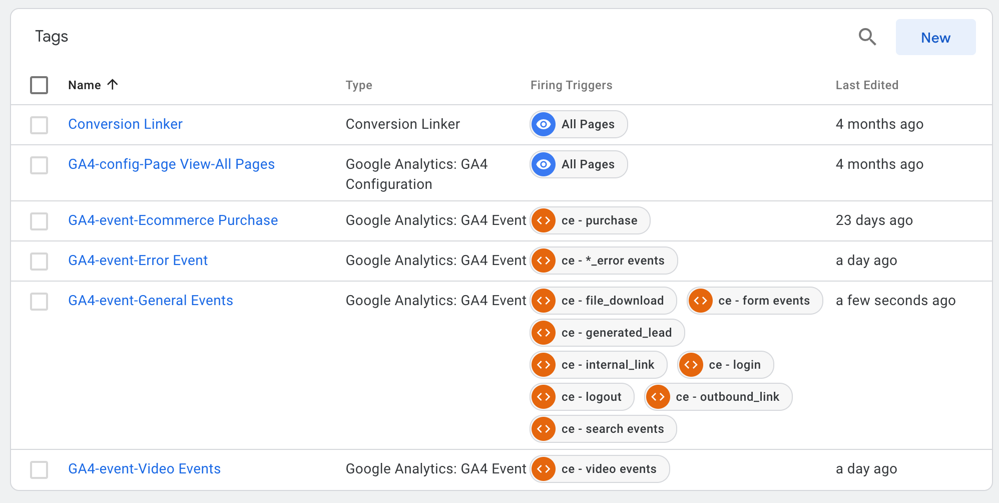

# AnalyticsWeb

[](https://www.github.com/arsari/AnalyticsWeb/tags "Go to AnalyticsWeb Releases-Tags!")&nbsp;&nbsp;&nbsp;&nbsp;[](LICENSE "Click to see License")<br>[](https://arsari.github.io/AnalyticsMobile "Click Here to Visit Repo Document!")

## Web Analytics Implementation Playground

### Table of Contents

<!-- Start Document Outline -->

- [Introduction](#introduction)
- [Tagging Implementation](#tagging-implementation)
  - [General Events](#general-events)
  - [Purchase Event](#purchase-event)
  - [Video Events](#video-events)
  - [Error Events](#error-events)
- [GTM Setup](#gtm-setup)
- [Reference Documentation](#reference-documentation)

<!-- End Document Outline -->

### Introduction

Google Analytics 4 (GA4) and Adobe Analytics (AA) are the most used tools for a comprehensive and flexible approach to website and apps analytics. To implement GA4 and AA on our website, will need to follow these steps:

- Create a GA4 property or AA data stream in our corresponding tool account.
- Set up our GA4 and AA tracking code on our website.
- Verify the GA4 and AA installation.
- Configure our GA4 property reports and AA analysis warehouse dashboard settings.
- Start tracking our website traffic.

Overall, implementing GA4 and AA on our website involves creating a new property and data stream, adding the tracking code to our website, verifying our installation, configuring our analytics settings, and tracking our website traffic.

This is self playground of analytic implementation on a website through GTM and a GA4 web data stream, as well through Tealium IQ and Adobe Analytics. The implementation allows to explore a:

- dataLayer array-objects managed through GTM and analyzing the data in a GA4 web data stream,
- utag.link() data objects managed through Tealium IQ tag manager and analyzing the data in an Adobe Analytics data stream.
- Initial setup of Adobe Launch rules to see response in the browser console.


The implementation fires an initial `dataLayer` array-object and a `utag_data` object variable on each web page.

The `dataLayer` array-object should be located inside the `<head>...</head>` tag of the web page before the GTM snippet.

```html
<!-- dataLayers init -->
<script type="text/javascript">
  window.dataLayer = window.dataLayer || [];
  window.dataLayer.push({
    event: "initData",
    page_title: document.querySelector("title").innerText,
    page_name: "Web Analytics Implementation - Home Page",
    page_author: "Arturo Santiago-Rivera",
    author_email: "asantiago@arsari.com",
    content_group: "Implementation",
    content_type: "Playground",
    language_code: "en-US",
    event_timestamp: String(new Date().getTime()), // milliseconds
    // user properties
    logged_in: false,
    user_id: localStorage.UUID ? localStorage.UUID : "guest",
  });
</script>
```

The `utag_data` object variable should be located inside the `<body>...</body>` tag of the web page before the Tealium IQ snippet.

```html
<!-- utag data object init -->
<script type="text/javascript">
  const utag_data = {
    page_title: document.querySelector("title").innerText,
    page_name: "Web Analytics Implementation - Home Page",
    page_author: "Arturo Santiago-Rivera",
    author_email: "asantiago@arsari.com",
    content_group: "Implementation",
    content_type: "Playground",
    language_code: "en-US",
    event_timestamp: String(new Date().getTime()), // milliseconds
    // user properties
    logged_in: false,
    user_id: localStorage.UUID ? localStorage.UUID : "guest",
    custom_user_id: localStorage.UUID ? localStorage.UUID : "guest",
  };
</script>
<!-- END: utag data object init -->
```

### Tagging Implementation

The tagging implementation for events log consider the followings user actions (ui interactions), system events (content tools), and errors based on an element click attribute `[name="action"]` and a `addEventListener()` method to fire the corresponding **events**:

| User Action             | Event               | Type             | Parameters                                                                                                          | GA4 Scope                                                   | GA4 Custom Definitions                                                                   |
| ----------------------- | ------------------- | ---------------- | ------------------------------------------------------------------------------------------------------------------- | ----------------------------------------------------------- | ---------------------------------------------------------------------------------------- |
| Sign In                 | login               | user interaction | method                                                                                                              | Event                                                       | Predefined                                                                               |
| Sign In                 | login_error         | content tool     | error_message<br>alert_impression                                                                                   | Event<br>Event<br>                                          | Dimension<br>Dimension                                                                   |
| Outbound Link           | outbound_link       | user interaction | link_domain<br>link_classes<br>link_id<br>link_url<br>link_text<br>outbound                                         | Event<br>Event<br>Event<br>Event<br>Event<br>Event          | Predefined<br>Predefined<br>Predefined<br>Predefined<br>Predefined<br>Predefined         |
| Internal Link           | internal_link       | user interaction | link_domain<br>link_classes<br>link_id<br>link_url<br>link_text                                                     | Event<br>Event<br>Event<br>Event<br>Event                   | Predefined<br>Predefined<br>Predefined<br>Predefined<br>Predefined                       |
| Download                | file_download       | user interaction | file_name<br>file_extension<br>link_domain<br>link_classes<br>link_id<br>link_text                                  | Event<br>Event<br>Event<br>Event<br>Event<br>Event          | Predefined<br>Predefined<br>Predefined<br>Predefined<br>Predefined<br>Predefined         |
| Video                   | video_start         | user interaction | video_duration<br>video_current_time<br>video_percent<br>video_status<br>video_provider<br>video_title<br>video_url | Event<br>Event<br>Event<br>Event<br>Event<br>Event<br>Event | Metric (sec)<br>Metric (sec)<br>Dimension<br>Dimension<br>Predefined<br>Predefined<br>Predefined     |
|                         | video_progress      | content tool     | video_duration<br>video_current_time<br>video_percent<br>video_status<br>video_provider<br>video_title<br>video_url | Event<br>Event<br>Event<br>Event<br>Event<br>Event<br>Event | Metric (sec)<br>Metric (sec)<br>Dimension<br>Dimension<br>Predefined<br>Predefined<br>Predefined     |
|                         | video_complete      | content tool     | video_duration<br>video_current_time<br>video_percent<br>video_status<br>video_provider<br>video_title<br>video_url | Event<br>Event<br>Event<br>Event<br>Event<br>Event<br>Event | Metric (sec)<br>Metric (sec)<br>Dimension<br>Dimension<br>Predefined<br>Predefined<br>Predefined     |
| Video playing           | video_stop          | user interaction | video_duration<br>video_current_time<br>video_percent<br>video_status<br>video_provider<br>video_title<br>video_url | Event<br>Event<br>Event<br>Event<br>Event<br>Event<br>Event | Metric (sec)<br>Metric (sec)<br>Dimension<br>Dimension<br>Predefined<br>Predefined<br>Predefined     |
| Email                   | generate_lead       | user interaction | contact_method<br>currency<br>value                                                                                 | Event<br>Event<br>Event                                     | Dimension<br>Predefined<br>Predefined                                                    |
| Phone                   | generate_lead       | user interaction | contact_method<br>currency<br>value                                                                                 | Event<br>Event<br>Event                                     | Dimension<br>Predefined<br>Predefined                                                    |
| Form                    | form_start          | user interaction | form_destination<br>form_id<br>form_name                                                                            | Event<br>Event<br>Event                                     | Dimension<br>Dimension<br>Dimension                                                      |
| \* _Submit Button_      | form_submit         | user interaction | contact_method<br>form_destination<br>form_id<br>form_name<br>form_submit_text<br>value<br>user_profession          | Event<br>Event<br>Event<br>Event<br>Event<br>Event<br>Event | Dimension<br>Dimension<br>Dimension<br>Dimension<br>Dimension<br>Predefined<br>Dimension |
| \* _`X`_ (close form)   | form_modal_closed   | user interaction | form_id<br>form_name                                                                                                | Event<br>Event                                              | Dimension<br>Dimension                                                                   |
| Form                    | form_error          | content tool     | error_message<br>alert_impression                                                                                   | Event<br>Event                                              | Dimension<br>Dimension                                                                   |
| Purchase                | purchase            | user interaction | ecommerce.transaction_id<br>ecommerce.value<br>ecommerce.tax<br>ecommerce.shipping<br>ecommerce.items               | Event<br>Event<br>Event<br>Event<br>Event                   | Predefined<br>Predefined<br>Predefined<br>Predefined<br>Predefined                       |
| Search                  | search_modal_opened | user interaction |                                                                                                                     |                                                             |
| \* _Magnified Glass_    | search              | user interaction | search_term                                                                                                         | Event                                                       | Predefined                                                                               |
| \* _`X`_ (close search) | search_modal_closed | user interaction |                                                                                                                     |                                                             |
| Search                  | search_error        | content tool     | error_message<br>alert_impression                                                                                   | Event<br>Event                                              | Dimension<br>Dimension                                                                   |
| Sign Out                | logout              | user interaction |                                                                                                                     | Event                                                       | Dimension                                                                                |
| Sign Out                | logout_error        | content tool     | error_message<br>alert_impression                                                                                   | Event<br>Event                                              | Dimension<br>Dimension                                                                   |

The following global parameters apply to most of the above **events**:

| Global Parameters              | GA4 Scope | GA4 Custom Definitions |
| ------------------------------ | --------- | ---------------------- |
| event_type                     | Event     | Dimension              |
| button_text                    | Event     | Dimension              |
| tag_name                       | Event     | Dimension              |
| event_timestamp (milliseconds) | Event     | Dimension              |
| custom_timestamp (ISO 8601)    | Event     | Dimension              |
| custom_user_id (user Property) | User      | Dimension              |
| logged_in (user property)      | User      | Dimension              |
| user_id (user property)        | User      | Predefined             |

The events `dataLayer` array-object is based on [Google Analytics 4](https://support.google.com/analytics/answer/9322688?hl=en) events recommendations and [Google Tag Manager dataLayer](https://developers.google.com/tag-manager/devguide#datalayer). The `utag.link` data object is based on the [Tealium utag.link](https://community.tealiumiq.com/t5/Tealium-iQ-Tag-Management/utag-link-Reference/ta-p/1009) and [Adobe Analytics](https://marketing.adobe.com/resources/help/en_US/sc/implement/link-tracking.html) objects.

We classified the implementation of the `dataLayer` array-object and utag.link() data into the following:

- A [General Events](#general-events) `dataLayer` array-object and `utag.link` data object;
- A [Purchase Event](#purchase-event) `dataLayer` array-object and `utag.link` data object;
- A [Video Events](#video-events) `dataLayer` array-object and `utag.link` data object;
- An [Error Events](#error-events) `dataLayer` array-object and `utag.link` data object.

#### General Events

The implemented _general events_ `dataLayer` array-object and `utag.link` data object is composed of:

```js
window.dataLayer = window.dataLayer || [];
window.dataLayer.push({
  event: en || e.id,
  // event parameters
  button_text:
    e.tagName === "BUTTON" && e.innerText !== "" ? e.innerText : undefined,
  contact_method: cm,
  currency: cc,
  event_type: /generate_lead|form_submit/.test(en)
    ? "conversion"
    : "ui interaction",
  file_extension: e.id === "download" ? "pdf" : undefined,
  file_name: e.id === "download" ? "PDF_to_Download" : undefined,
  form_destination: fd,
  form_id: e.id.includes("form") ? e.id : undefined,
  form_name: e.id.includes("form") ? "User Profession Survey" : undefined,
  form_submit_text: e.id === "form" ? e.innerText : undefined,
  link_domain: ld,
  link_classes: lc,
  link_id: /extlink|intlink|download|banner/.test(e.id) ? e.id : undefined,
  link_url: lu,
  link_text: /extlink|intlink|download|banner/.test(e.id)
    ? e.innerText
    : undefined,
  method: e.id === "login" ? "Google" : undefined,
  outbound: ol,
  search_term: st,
  tag_name: e.tagName,
  value: ev,
  video_duration:
    e.id.includes("video") && (vplay === true || vstop === true)
      ? vd
      : undefined,
  video_current_time:
    e.id.includes("video") && (vplay === true || vstop === true)
      ? vct
      : undefined,
  video_percent:
    e.id.includes("video") && (vplay === true || vstop === true)
      ? vpct
      : undefined,
  video_status:
    e.id.includes("video") && (vplay === true || vstop === true)
      ? vs
      : undefined,
  video_provider:
    e.id.includes("video") && (vplay === true || vstop === true)
      ? vp
      : undefined,
  video_title:
    e.id.includes("video") && (vplay === true || vstop === true)
      ? vt
      : undefined,
  video_url:
    e.id.includes("video") && (vplay === true || vstop === true)
      ? vu
      : undefined,
  event_timestamp: tstamp, // milliseconds
  custom_timestamp: cstamp, // ISO 8601
  // user properties
  logged_in: logged,
  user_id: ui,
  user_profession: up,
});

utag.link({
  tealium_event: en || e.id,
  // event parameters
  button_text:
    e.tagName === "BUTTON" && e.innerText !== "" ? e.innerText : undefined,
  contact_method: cm,
  currency: cc,
  event_type: /generate_lead|form_submit/.test(en)
    ? "conversion"
    : "ui interaction",
  file_extension: e.id === "download" ? "pdf" : undefined,
  file_name: e.id === "download" ? "PDF_to_Download" : undefined,
  form_destination: fd,
  form_id: e.id.includes("form") ? e.id : undefined,
  form_name: e.id.includes("form") ? "User Profession Survey" : undefined,
  form_submit_text: e.id === "form" ? e.innerText : undefined,
  link_domain: ld,
  link_classes: lc,
  link_id: /extlink|intlink|download|banner/.test(e.id) ? e.id : undefined,
  link_url: lu,
  link_text: /extlink|intlink|download|banner/.test(e.id)
    ? e.innerText
    : undefined,
  method: e.id === "login" ? "Google" : undefined,
  outbound: ol,
  search_term: st,
  tag_name: e.tagName,
  value: ev,
  video_duration:
    e.id.includes("video") && (vplay === true || vstop === true)
      ? vd
      : undefined,
  video_current_time:
    e.id.includes("video") && (vplay === true || vstop === true)
      ? vct
      : undefined,
  video_percent:
    e.id.includes("video") && (vplay === true || vstop === true)
      ? vpct
      : undefined,
  video_status:
    e.id.includes("video") && (vplay === true || vstop === true)
      ? vs
      : undefined,
  video_provider:
    e.id.includes("video") && (vplay === true || vstop === true)
      ? vp
      : undefined,
  video_title:
    e.id.includes("video") && (vplay === true || vstop === true)
      ? vt
      : undefined,
  video_url:
    e.id.includes("video") && (vplay === true || vstop === true)
      ? vu
      : undefined,
  event_timestamp: tstamp, // milliseconds
  custom_timestamp: cstamp, // ISO 8601
  // user properties
  logged_in: logged,
  user_id: ui,
  custom_user_id: ui,
  user_profession: up,
});
```

#### Purchase Event

The implemented _purchase event_ `dataLayer` array-object and `utag.link` data object is composed of:

```js
window.dataLayer = window.dataLayer || [];
window.dataLayer.push({
  ecommerce: null,
}); // Clear the previous ecommerce object
window.dataLayer = window.dataLayer || [];
window.dataLayer.push({
  event: e.id,
  // event parameters
  event_type: "conversion",
  button_text: e.innerText,
  tag_name: e.tagName,
  ecommerce: {
    transaction_id: transactionID,
    affiliation: "Merchandise Store",
    coupon: "SUMMER_SALE",
    currency: "USD",
    shipping: Number((subtotal * 0.12).toFixed(2)),
    tax: Number((subtotal * 0.07).toFixed(2)),
    value: subtotal,
    items: [
      {
        item_id: sku1,
        item_name: "Stan and Friends Tee",
        affiliation: "Merchandise Store",
        coupon: "SUMMER_FUN",
        currency: "USD",
        discount: itemDiscount,
        index: 0,
        item_brand: "MyCollection",
        item_category: "Apparel",
        item_category2: "Adult",
        item_category3: "Shirts",
        item_category4: "Crew",
        item_category5: "Short sleeve",
        item_list_id: "related_products",
        item_list_name: "Related Products",
        item_variant: "green",
        location_id: "ChIJIQBpAG2ahYAR_6128GcTUEo",
        price: itemPrice,
        quantity: itemQty,
      },
      {
        item_id: sku2,
        item_name: "Friends Pants",
        affiliation: "Merchandise Store",
        coupon: "SUMMER_FUN",
        currency: "USD",
        discount: itemDiscount,
        index: 1,
        item_brand: "MyCollection",
        item_category: "Apparel",
        item_category2: "Adult",
        item_category3: "Pants",
        item_category4: "Crew",
        item_category5: "Regular Fit",
        item_list_id: "related_products",
        item_list_name: "Related Products",
        item_variant: "blue",
        location_id: "ChIJIQBpAG2ahYAR_6128GcTUEo",
        price: itemPrice,
        quantity: itemQty,
      },
    ],
  },
  event_timestamp: tstamp, // milliseconds
  custom_timestamp: cstamp, // ISO 8601
  // user properties
  logged_in: logged,
  user_id: ui,
});

utag.link({
  ecommerce: null,
}); // Clear the previous ecommerce object
utag.link({
  tealium_event: e.id,
  // event parameters
  event_type: "conversion",
  button_text: e.innerText,
  tag_name: e.tagName,
  ecommerce: {
    transaction_id: transactionID,
    affiliation: "Merchandise Store",
    coupon: "SUMMER_SALE",
    currency: "USD",
    shipping: Number((subtotal * 0.12).toFixed(2)),
    tax: Number((subtotal * 0.07).toFixed(2)),
    value: subtotal,
    items: [
      {
        item_id: sku1,
        item_name: "Stan and Friends Tee",
        affiliation: "Merchandise Store",
        coupon: "SUMMER_FUN",
        currency: "USD",
        discount: itemDiscount,
        index: 0,
        item_brand: "MyCollection",
        item_category: "Apparel",
        item_category2: "Adult",
        item_category3: "Shirts",
        item_category4: "Crew",
        item_category5: "Short sleeve",
        item_list_id: "related_products",
        item_list_name: "Related Products",
        item_variant: "green",
        location_id: "ChIJIQBpAG2ahYAR_6128GcTUEo",
        price: itemPrice,
        quantity: itemQty,
      },
      {
        item_id: sku2,
        item_name: "Friends Pants",
        affiliation: "Merchandise Store",
        coupon: "SUMMER_FUN",
        currency: "USD",
        discount: itemDiscount,
        index: 1,
        item_brand: "MyCollection",
        item_category: "Apparel",
        item_category2: "Adult",
        item_category3: "Pants",
        item_category4: "Crew",
        item_category5: "Regular Fit",
        item_list_id: "related_products",
        item_list_name: "Related Products",
        item_variant: "blue",
        location_id: "ChIJIQBpAG2ahYAR_6128GcTUEo",
        price: itemPrice,
        quantity: itemQty,
      },
    ],
  },
  event_timestamp: tstamp, // milliseconds
  custom_timestamp: cstamp, // ISO 8601
  // user properties
  logged_in: logged,
  user_id: ui,
  custom_user_id: ui,
});
```

#### Video Events

The _video events_ use the _general events_ `dataLayer` array-object and `utag.link` data object excluding the _video progress event_ which use a unique `dataLayer` array-object and `utag.link` data object.

Using `setInterval()` function we implement the _video progress event_.

The implemented _video progress event_ `dataLayer` array-object and `utag.link` data object is composed of:

```js
window.dataLayer = window.dataLayer || [];
window.dataLayer.push({
  event: en,
  event_type: "content tool",
  video_duration: vd,
  video_current_time: vct,
  video_percent: vpct,
  video_status: vs,
  video_provider: vp,
  video_title: vt,
  video_url: vu,
  event_timestamp: tstamp, // milliseconds
  custom_timestamp: cstamp, // ISO 8601
  // user properties
  logged_in: logged,
  user_id: ui,
});

utag.link({
  tealium_event: en,
  event_type: "content tool",
  video_duration: vd,
  video_current_time: vct,
  video_percent: vpct,
  video_status: vs,
  video_provider: vp,
  video_title: vt,
  video_url: vu,
  event_timestamp: tstamp, // milliseconds
  custom_timestamp: cstamp, // ISO 8601
  // user properties
  logged_in: logged,
  user_id: ui,
  custom_user_id: ui,
});
```

#### Error Events

The error events is a function that is called when errors occurs for Search event, Form event, Sing In event, and Sign Out event.

The implemented _error events_ `dataLayer` array-object and `utag.link` data object is composed of:

```js
window.dataLayer = window.dataLayer || [];
window.dataLayer.push({
  event: `${e.id}_error`,
  event_type: "content tool",
  button_text: e.innerText,
  tag_name: e.tagName,
  error_message: m,
  alert_impression: true,
  event_timestamp: tstamp, // milliseconds
  custom_timestamp: cstamp, // ISO 8601
  // user properties
  logged_in: l,
  user_id: u,
});

utag.link({
  tealium_event: `${e.id}_error`,
  event_type: "content tool",
  button_text: e.innerText,
  tag_name: e.tagName,
  error_message: m,
  alert_impression: true,
  event_timestamp: tstamp, // milliseconds
  custom_timestamp: cstamp, // ISO 8601
  // user properties
  logged_in: l,
  user_id: u,
  custom_user_id: ui,
});
```

### GTM Setup

The `dataLayer` array-object for the four main event objects has been setup in GTM with individual tags and triggers.



### Reference Documentation

- [Google Analytics 4](https://support.google.com/analytics/answer/9322688?hl=en)
- [Google Tag Manager dataLayer](https://developers.google.com/tag-manager/devguide#datalayer)
- [Tealium utag.link](https://community.tealiumiq.com/t5/Tealium-iQ-Tag-Management/utag-link-Reference/ta-p/1009)
- [Adobe Analytics](https://marketing.adobe.com/resources/help/en_US/sc/implement/link-tracking.html)

=====

Copyright 2022-2023 | [Arturo Santiago-Rivera](mailto:asantiago@arsari.com) | [MIT License](LICENSE)
