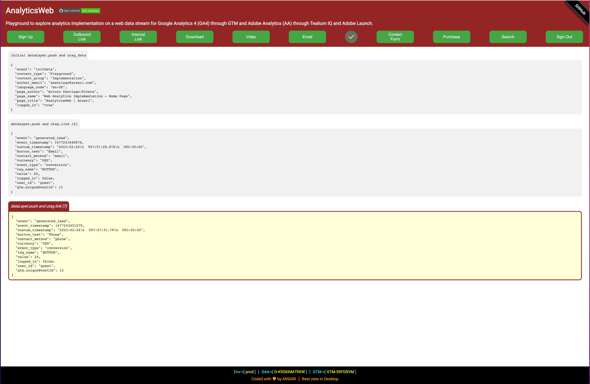
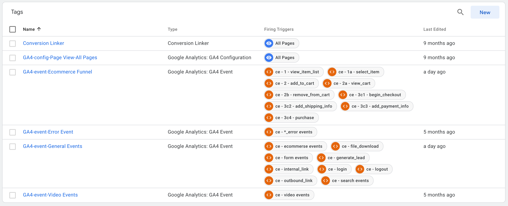

# AnalyticsWeb

[](https://www.github.com/arsari/AnalyticsWeb/tags "Go to AnalyticsWeb Releases-Tags!")&nbsp;&nbsp;&nbsp;&nbsp;[](LICENSE "Click to see License")<br>[](https://arsari.github.io/AnalyticsMobile "Click Here to Visit Repo Document!")

## Web Analytics Implementation Playground

### Table of Contents

<!-- Start Document Outline -->

- [AnalyticsWeb](#analyticsweb)
  - [Web Analytics Implementation Playground](#web-analytics-implementation-playground)
    - [Table of Contents](#table-of-contents)
    - [Introduction](#introduction)
    - [Tagging Strategy and Implementation](#tagging-strategy-and-implementation)
      - [General Events](#general-events)
        - [`dataLayer`](#datalayer)
        - [`utag.link()`](#utaglink)
        - [`amplitude.track()`](#amplitudetrack)
      - [Ecommerce Funnel Events](#ecommerce-funnel-events)
      - [Video Events](#video-events)
      - [Error Events](#error-events)
    - [GTM Setup](#gtm-setup)
      - [General Events Tag](#general-events-tag)
      - [Ecommerce Funnel Tag](#ecommerce-funnel-tag)
      - [Error Events Tag](#error-events-tag)
      - [Video Events Tag](#video-events-tag)
    - [Reference Documentation](#reference-documentation)

<!-- End Document Outline -->

### Introduction

Google Analytics 4 (GA4) and Adobe Analytics (AA) are the most used tools for a comprehensive and flexible approach to website and apps analytics. Amplitude Analytics and  Mixpanel Product Analytics are two other tools that lets you answer questions, make better decisions and drive outcomes with product analytics. For any of the aforementioned tools, to do an implementation on our website, will need to follow these steps:

1. Create an account or property in the corresponding tool account.
2. Install the tool tracking code or instrumentation on our website.
3. Verify the tool installation.
4. Configure tool reports, analysis workspace, and dashboard settings.
5. Start tracking our website traffic.

This is a playground of analytic implementation for a website using GTM and a GA4 web data stream, Tealium iQ and Adobe Analytics, and Amplitude Analytics. The implementation allows to explore:

- a dataLayer array-objects managed through GTM and analyzing the data in a GA4 web data stream,
- a utag_data variable object and utag.link() data objects managed through Tealium iQ tag management and analyzing the data in Adobe Analytics.
- Amplitude data objects to analyze the data in Amplitude Analytics.
- an initial setup of Mixpanel data object to analyze data in Mixpanel Product Analytics.
- an initial setup of Adobe Launch rules to see response in the browser console (experimental implementation).

Before we start with the playground set up and back end, we should already have a GTM container linked to a Google Analytics 4 web data stream, a Tealium iQ account setup with AA tag, an Adobe Analytics account, an Amplitude Analytics account, and a  Mixpanel Product Analytics account. Having them created and configured will facilitate the use of playground as a data source for the tools.



### Tagging Strategy and Implementation

The implementation fires an initial `dataLayer` object (GTM), `utag_data` object variable (TiQ) and an  `enrichEventsPlugin` function (Amplitude), and a page view track for Mixapanel on each website page.

The `dataLayer` array-object should be located inside the `<head>...</head>` tag of the web page before the GTM snippet.

```html
<!-- dataLayers message -->
<script type="text/javascript">
  const userInit = localStorage.UUID ?? "guest";
  window.dataLayer = window.dataLayer || [];
  window.dataLayer.push({
    page_title: document.querySelector("title").innerText,
    page_name: "Web Analytics Implementation - Home Page",
    page_category: "home",
    page_author: "Arturo Santiago-Rivera",
    author_email: "asantiago@arsari.com",
    content_group: "Implementation",
    content_type: "Playground",
    language_code: "en-US",
    e_timestamp: String(new Date().getTime()), // milliseconds
    // user properties
    logged_in: false,
    user_id: userInit,
  });
</script>
<!-- END: dataLayers message -->
```

The `utag_data` variable should be located inside the `<body>...</body>` tag of the web page before the Tealium IQ snippet.

```html
<!-- utag data object message -->
<script type="text/javascript">
  const utag_data = {
    page_title: document.querySelector("title").innerText,
    page_name: "Web Analytics Implementation - Home Page",
    page_category: "home",
    page_author: "Arturo Santiago-Rivera",
    author_email: "asantiago@arsari.com",
    content_group: "Implementation",
    content_type: "Playground",
    language_code: "en-US",
    e_timestamp: String(new Date().getTime()), // milliseconds
    // user properties
    logged_in: false,
    user_id: userInit,
    custom_user_id: userInit,
  };
</script>
<!-- END: utag data object message -->
```

The Amplitude data object should be located inside the `<head>...</head>` tag of the web page after the Amplitude snippet but before to their statement of initialization. The initial Amplitude data object, that include events properties and user properties applicable to all the events, is coded in an enrich plugin variable. The enrich plugin variable needs to be called before the amplitude statement of initialization..

```js
/* Amplitude data object init */
const enrichEventsPlugin = () => ({
    execute: async (event) => {
      event.event_properties = {
        ...event.event_properties,
        page_title: document.querySelector('title').innerText,
        page_name: 'Web Analytics Implementation - Home Page',
        page_category: 'home',
        page_author: 'Arturo Santiago-Rivera',
        author_email: 'asantiago@arsari.com',
        content_group: 'Implementation',
        content_type: 'Playground',
        language_code: 'en-US',
        e_timestamp: String(new Date().getTime()), // milliseconds
        env_viewed: tealiumEnv,
      };
      event.user_properties = {
        ...event.user_properties,
        $set: {
          logged_in: logged ?? false,
        },
      };
      return event;
    },
});
amplitude.add(enrichEventsPlugin()); // amplitude enrich plugin call
amplitude.init(<<AMPLITUDE_API_KEY>>, userInit); // amplitude init statement
```

The tagging implementation for events consider the followings user actions (ui interactions), system events (content tools), and errors based on an element click attribute `[name="action"]` and a `addEventListener()` method to fire the corresponding **events**:

| User Action          | Event Name                  | Type             | Parameters/Event Properties                                                                                                                                                | GA4 Scope                                                            | GA4 Custom Definitions                                                                                       |
| -------------------- | --------------------------- | ---------------- | -------------------------------------------------------------------------------------------------------------------------------------------------------------------------- | -------------------------------------------------------------------- | ------------------------------------------------------------------------------------------------------------ |
| Sign In              | login                       | user interaction | method                                                                                                                                                                     | Event                                                                | Predefined                                                                                                   |
| Outbound Link        | outbound_link               | user interaction | link_domain<br>link_classes<br>link_id<br>link_url<br>link_text<br>outbound                                                                                                | Event<br>Event<br>Event<br>Event<br>Event<br>Event                   | Predefined<br>Predefined<br>Predefined<br>Predefined<br>Predefined<br>Predefined                             |
| Internal Link        | internal_link               | user interaction | link_domain<br>link_classes<br>link_id<br>link_url<br>link_text                                                                                                            | Event<br>Event<br>Event<br>Event<br>Event                            | Predefined<br>Predefined<br>Predefined<br>Predefined<br>Predefined                                           |
| Download             | file_download               | user interaction | file_name<br>file_extension<br>link_domain<br>link_classes<br>link_id<br>link_text                                                                                         | Event<br>Event<br>Event<br>Event<br>Event<br>Event                   | Predefined<br>Predefined<br>Predefined<br>Predefined<br>Predefined<br>Predefined                             |
| Video                | video_start                 | user interaction | video_duration<br>video_current_time<br>video_percent<br>video_status<br>video_provider<br>video_title<br>video_url                                                        | Event<br>Event<br>Event<br>Event<br>Event<br>Event<br>Event          | Metric (sec)<br>Metric (sec)<br>Dimension<br>Dimension<br>Predefined<br>Predefined<br>Predefined             |
| Video Playing        | video_progress              | content tool     | video_duration<br>video_current_time<br>video_percent<br>video_status<br>video_provider<br>video_title<br>video_url                                                        | Event<br>Event<br>Event<br>Event<br>Event<br>Event<br>Event          | Metric (sec)<br>Metric (sec)<br>Dimension<br>Dimension<br>Predefined<br>Predefined<br>Predefined             |
| Video Playing        | video_complete              | content tool     | video_duration<br>video_current_time<br>video_percent<br>video_status<br>video_provider<br>video_title<br>video_url                                                        | Event<br>Event<br>Event<br>Event<br>Event<br>Event<br>Event          | Metric (sec)<br>Metric (sec)<br>Dimension<br>Dimension<br>Predefined<br>Predefined<br>Predefined             |
| Video playing        | video_stop                  | user interaction | video_duration<br>video_current_time<br>video_percent<br>video_status<br>video_provider<br>video_title<br>video_url                                                        | Event<br>Event<br>Event<br>Event<br>Event<br>Event<br>Event          | Metric (sec)<br>Metric (sec)<br>Dimension<br>Dimension<br>Predefined<br>Predefined<br>Predefined             |
| Email                | generate_lead               | user interaction | contact_method<br>currency<br>value                                                                                                                                        | Event<br>Event<br>Event                                              | Dimension<br>Predefined<br>Predefined                                                                        |
| Phone                | generate_lead               | user interaction | contact_method<br>currency<br>value                                                                                                                                        | Event<br>Event<br>Event                                              | Dimension<br>Predefined<br>Predefined                                                                        |
| Form                 | form_start                  | user interaction | form_destination<br>form_id<br>form_name                                                                                                                                   | Event<br>Event<br>Event                                              | Dimension<br>Dimension<br>Dimension                                                                          |
| \* _Submit Button_   | form_submit                 | user interaction | contact_method<br>form_destination<br>form_id<br>form_name<br>form_submit_text<br>value<br>user_profession                                                                 | Event<br>Event<br>Event<br>Event<br>Event<br>Event<br>Event          | Dimension<br>Dimension<br>Dimension<br>Dimension<br>Dimension<br>Predefined<br>Dimension                     |
| \* Close             | form_modal_closed           | user interaction | form_id<br>form_name                                                                                                                                                       | Event<br>Event                                                       | Dimension<br>Dimension                                                                                       |
| Form                 | form_error                  | content tool     | error_message<br>alert_impression                                                                                                                                          | Event<br>Event                                                       | Dimension<br>Dimension                                                                                       |
| Ecommerce Funnel     | ecommerce_modal_opened      | user interaction |                                                                                                                                                                            |                                                                      |                                                                                                              |
| Ecommerce Funnel     | view_item_list              | content tool     | ecommerce.item_list_id<br>ecommerce.item_list_name<br>ecommerce.items                                                                                                      | Event<br>Event<br>Event                                              | Predefined<br>Predefined<br>Predefined                                                                       |
| Ecommerce Funnel     | select_item                 | user interaction | ecommerce.item_list_id<br>ecommerce.item_list_name<br>ecommerce.items                                                                                                      | Event<br>Event<br>Event                                              | Predefined<br>Predefined<br>Predefined                                                                       |
| Ecommerce Funnel     | add_to_cart                 | user interaction | ecommerce.currency<br>ecommerce.value<br>ecommerce.items                                                                                                                   | Event<br>Event<br>Event                                              | Predifined<br>Predifined<br>Predifined                                                                       |
| Ecommerce Funnel     | view_cart                   | content tool     | ecommerce.currency<br>ecommerce.value<br>ecommerce.items                                                                                                                   | Event<br>Event<br>Event                                              | Predifined<br>Predifined<br>Predifined                                                                       |
| Ecommerce Funnel     | remove_from_cart            | user interaction | alert_message<br>alert_impression<br>ecommerce.currency<br>ecommerce.value<br>ecommerce.items                                                                              | Event<br>Event<br>Event<br>Event<br>Event                            | Dimension<br>Dimension<br>Predifined<br>Predifined<br>Predifined                                             |
| Ecommerce Funnel     | begin_checkout              | user interaction | ecommerce.currency<br>ecommerce.value<br>ecommerce.coupon<br>ecommerce.items                                                                                               | Event<br>Event<br>Event<br>Event                                     | Predifined<br>Predifined<br>Predifined<br>Predifined                                                         |
| Ecommerce Funnel     | add_shipping_info           | user interaction | ecommerce.currency<br>ecommerce.value<br>ecommerce.coupon<br>ecommerce.shipping_tier<br>ecommerce.items                                                                    | Event<br>Event<br>Event<br>Event<br>Event                            | Predifined<br>Predifined<br>Predifined<br>Predifined<br>Predifined                                           |
| Ecommerce Funnel     | add_payment_info            | user interaction | ecommerce.currency<br>ecommerce.value<br>ecommerce.coupon<br>ecommerce.payment_type<br>ecommerce.items                                                                     | Event<br>Event<br>Event<br>Event<br>Event                            | Predifined<br>Predifined<br>Predifined<br>Predifined<br>Predifined                                           |
| Ecommerce Funnel     | purchase                    | user interaction | ecommerce.transaction_id<br>ecommerce.currency<br>ecommerce.value<br>ecommerce.tax<br>ecommerce.shipping<br>ecommerce.coupon<br>ecommerce.shipping_tier<br>ecommerce.items | Event<br>Event<br>Event<br>Event<br>Event<br>Event<br>Event<br>Event | Predifined<br>Predifined<br>Predifined<br>Predifined<br>Predifined<br>Predifined<br>Predifined<br>Predifined |
| Ecommerce Funnel     | refund                      | user interaction | ecommerce.transaction_id<br>ecommerce.currency<br>ecommerce.value<br>ecommerce.tax<br>ecommerce.shipping<br>ecommerce.coupon<br>ecommerce.items                            | Event<br>Event<br>Event<br>Event<br>Event<br>Event<br>Event          | Predifined<br>Predifined<br>Predifined<br>Predifined<br>Predifined<br>Predifined<br>Predifined               |
| Ecommerce Funnel     | \<ecommerce events\>\_error | content tool     | error_message<br>alert_impression<br>step                                                                                                                                  | Event<br>Event<br>Event                                              | Dimension<br>Dimension<br>Dimension                                                                          |
| \* Cancel            | ecommerce_modal_closed      | user interaction |                                                                                                                                                                            |                                                                      |
| Search               | search_modal_opened         | user interaction |                                                                                                                                                                            |                                                                      |
| \* _Magnified Glass_ | search                      | user interaction | search_term                                                                                                                                                                | Event                                                                | Predefined                                                                                                   |
| \* Close             | search_modal_closed         | user interaction |                                                                                                                                                                            |                                                                      |
| Search               | search_error                | content tool     | error_message<br>alert_impression                                                                                                                                          | Event<br>Event                                                       | Dimension<br>Dimension                                                                                       |
| Sign Out             | logout                      | user interaction |                                                                                                                                                                            | Event                                                                | Dimension                                                                                                    |

The following global parameters/event properties apply to most of the above **events**:

| Global Parameters/Event Properties      | GA4 Scope | GA4 Custom Definitions |
| --------------------------------------- | --------- | ---------------------- |
| event_id (gtm config parameter)         | Event     | Dimension              |
| event_type                              | Event     | Dimension              |
| button_text                             | Event     | Dimension              |
| tag_name                                | Event     | Dimension              |
| env_viewed (only amplitude)             | n/a       | n/a                    |
| step (ecommerce events only)            | Event     | Dimension              |
| section_heading (ecommerce events only) | Event     | Dimension              |
| e_timestamp (milliseconds)              | Event     | Dimension              |
| custom_timestamp (ISO 8601)             | Event     | Dimension              |
| custom_user_id (user Property)          | User      | Dimension              |
| logged_in (user property)               | User      | Dimension              |
| user_id (user property)                 | User      | Predefined             |

> For Amplitude Analytics the event name is modified in the events list as noun+verb capitalizing each word. The event properties naming is sneak_case.

The events `dataLayer` array-object is based on [Google Analytics 4](https://support.google.com/analytics/answer/9322688?hl=en) events recommendations and [Google Tag Manager dataLayer](https://developers.google.com/tag-manager/devguide#datalayer). The `utag.link` data object is based on the [Tealium utag.link](https://community.tealiumiq.com/t5/Tealium-iQ-Tag-Management/utag-link-Reference/ta-p/1009) and [Adobe Analytics](https://marketing.adobe.com/resources/help/en_US/sc/implement/link-tracking.html) objects. The Amplitude Analytics data object is based on the Amplitude source [Browser SDK 2.0](https://www.docs.developers.amplitude.com/data/sdks/browser-2/).

We classified the implementation of the `dataLayer[]` array-object, `utag.link()` data object, and `amplitude.track()` data object into the following event groups:

- [General Events](#general-events)
- [Ecommerce Funnel Events](#ecommerce-funnel-events)
- [Video Events](#video-events)
- [Error Events](#error-events)

#### General Events

The implemented _general events_ `dataLayer` array-object, `utag.link` data object, and `amplitude.track` data object is composed of:

##### `dataLayer`

```js
window.dataLayer = window.dataLayer || [];
window.dataLayer.push({
  event: en || e.id,
  // event parameters
  button_text:
    e.tagName === "BUTTON" && e.innerText !== "" ? e.innerText : undefined,
  contact_method: cm,
  currency: cc,
  event_type: /generate_lead|form_submit/.test(en)
    ? "conversion"
    : "ui interaction",
  file_extension: e.id === "download" ? "pdf" : undefined,
  file_name: e.id === "download" ? "PDF_to_Download" : undefined,
  form_destination: fd,
  form_id: e.id.includes("form") ? e.id : undefined,
  form_name: e.id.includes("form") ? "User Profession Survey" : undefined,
  form_submit_text: e.id === "form" ? e.innerText : undefined,
  link_domain: ld,
  link_classes: lc,
  link_id: /extlink|intlink|download|banner/.test(e.id) ? e.id : undefined,
  link_url: lu,
  link_text: /extlink|intlink|download|banner/.test(e.id)
    ? e.innerText
    : undefined,
  method: e.id === "login" ? "Google" : undefined,
  outbound: ol,
  search_term: st,
  tag_name: e.tagName,
  value: ev,
  video_duration:
    e.id.includes("video") && (vplay === true || vstop === true)
      ? vd
      : undefined,
  video_current_time:
    e.id.includes("video") && (vplay === true || vstop === true)
      ? vct
      : undefined,
  video_percent:
    e.id.includes("video") && (vplay === true || vstop === true)
      ? vpct
      : undefined,
  video_status:
    e.id.includes("video") && (vplay === true || vstop === true)
      ? vs
      : undefined,
  video_provider:
    e.id.includes("video") && (vplay === true || vstop === true)
      ? vp
      : undefined,
  video_title:
    e.id.includes("video") && (vplay === true || vstop === true)
      ? vt
      : undefined,
  video_url:
    e.id.includes("video") && (vplay === true || vstop === true)
      ? vu
      : undefined,
  e_timestamp: tstamp, // milliseconds
  custom_timestamp: cstamp, // ISO 8601
  // user properties
  logged_in: logged,
  user_id: ui,
  user_profession: up,
});
```

##### `utag.link()`

```js
utag.link({
  tealium_event: en || e.id,
  // event parameters
  button_text:
    e.tagName === "BUTTON" && e.innerText !== "" ? e.innerText : undefined,
  contact_method: cm,
  currency: cc,
  event_type: /generate_lead|form_submit/.test(en)
    ? "conversion"
    : "ui interaction",
  file_extension: e.id === "download" ? "pdf" : undefined,
  file_name: e.id === "download" ? "PDF_to_Download" : undefined,
  form_destination: fd,
  form_id: e.id.includes("form") ? e.id : undefined,
  form_name: e.id.includes("form") ? "User Profession Survey" : undefined,
  form_submit_text: e.id === "form" ? e.innerText : undefined,
  link_domain: ld,
  link_classes: lc,
  link_id: /extlink|intlink|download|banner/.test(e.id) ? e.id : undefined,
  link_url: lu,
  link_text: /extlink|intlink|download|banner/.test(e.id)
    ? e.innerText
    : undefined,
  method: e.id === "login" ? "Google" : undefined,
  outbound: ol,
  search_term: st,
  tag_name: e.tagName,
  value: ev,
  video_duration:
    e.id.includes("video") && (vplay === true || vstop === true)
      ? vd
      : undefined,
  video_current_time:
    e.id.includes("video") && (vplay === true || vstop === true)
      ? vct
      : undefined,
  video_percent:
    e.id.includes("video") && (vplay === true || vstop === true)
      ? vpct
      : undefined,
  video_status:
    e.id.includes("video") && (vplay === true || vstop === true)
      ? vs
      : undefined,
  video_provider:
    e.id.includes("video") && (vplay === true || vstop === true)
      ? vp
      : undefined,
  video_title:
    e.id.includes("video") && (vplay === true || vstop === true)
      ? vt
      : undefined,
  video_url:
    e.id.includes("video") && (vplay === true || vstop === true)
      ? vu
      : undefined,
  e_timestamp: tstamp, // milliseconds
  custom_timestamp: cstamp, // ISO 8601
  // user properties
  logged_in: logged,
  user_id: ui,
  custom_user_id: ui,
  user_profession: up,
});
```

##### `amplitude.track()`

```js
amplitude.setUserId(ui);
amplitude.track({
  event_type: en || e.id,
  event_properties: {
    button_text: bt,
    contact_method: cm,
    currency: cc,
    event_type: /generate_lead|form_submit/i.test(en)
      ? "conversion"
      : "ui interaction",
    tag_name: e.tagName,
    file_extension: e.id === "download" ? "pdf" : undefined,
    file_name: e.id === "download" ? "PDF_to_Download" : undefined,
    form_destination: fd,
    form_id: e.id.includes("form") ? e.id : undefined,
    form_name: e.id.includes("form") ? "User Profession Survey" : undefined,
    form_submit_text: e.id === "form" ? fst : undefined,
    link_domain: ld,
    link_classes: lc,
    link_id: /extlink|intlink|download|banner/i.test(e.id) ? e.id : undefined,
    link_url: lu,
    link_text: /extlink|intlink|download|banner/i.test(e.id) ? bt : undefined,
    method: e.id === "login" ? "Google" : undefined,
    outbound: ol,
    search_term: st,
    value: ev,
    video_duration:
      e.id.includes("video") && (vplay === true || vstop === true)
        ? vd
        : undefined,
    video_current_time:
      e.id.includes("video") && (vplay === true || vstop === true)
        ? vct
        : undefined,
    video_percent:
      e.id.includes("video") && (vplay === true || vstop === true)
        ? vpct
        : undefined,
    video_status:
      e.id.includes("video") && (vplay === true || vstop === true)
        ? vs
        : undefined,
    video_provider:
      e.id.includes("video") && (vplay === true || vstop === true)
        ? vp
        : undefined,
    video_title:
      e.id.includes("video") && (vplay === true || vstop === true)
        ? vt
        : undefined,
    video_url:
      e.id.includes("video") && (vplay === true || vstop === true)
        ? vu
        : undefined,
    e_timestamp: tstamp, // milliseconds
    custom_timestamp: cstamp, // ISO 8601
  },
  user_properties: {
    $set: {
      user_profession: up,
    },
  },
});
```

#### Ecommerce Funnel Events

We have set up the _ecommerce funnel events_ in way that collect information about the shopping behavior of the users. The approach for this was based on the [Google Measure Ecommerce|https://developers.google.com/analytics/devguides/collection/ga4/ecommerce?client_type=gtm] guide in the Google Analytics 4 documentation.

**The items array-object**

The following is an example of a collection of items, `items` array-object, that we are using in our implementation. The items array can include up to 200 elements.

```js
const productList = [
  {
    item_name: "Stan and Friends Tee",
    affiliation: "Merchandise Store",
    item_brand: "MyCollection",
    item_category: "Apparel",
    item_category2: "Adult",
    item_category3: "Shirts",
    item_category4: "Crew",
    item_category5: "Short sleeve",
    item_list_id: "related_products",
    item_list_name: "Related Products",
    item_variant: "green",
    location_id: "ChIJIQBpAG2ahYAR_6128GcTUEo",
    price: 29.95,
  },
  {
    item_name: "Friends Pants",
    affiliation: "Merchandise Store",
    item_brand: "MyCollection",
    item_category: "Apparel",
    item_category2: "Adult",
    item_category3: "Pants",
    item_category4: "Crew",
    item_category5: "Regular Fit",
    item_list_id: "related_products",
    item_list_name: "Related Products",
    item_variant: "blue",
    location_id: "ChIJIQBpAG2ahYAR_6128GcTUEo",
    price: 39.95,
  },
  {
    item_name: "Canyonlands Full-Zip Hoodie",
    affiliation: "Merchandise Store",
    item_brand: "MyCollection",
    item_category: "Apparel",
    item_category2: "Adult",
    item_category3: "Jackets",
    item_category4: "Crew",
    item_category5: "Long sleeve",
    item_list_id: "related_products",
    item_list_name: "Related Products",
    item_variant: "black",
    location_id: "ChIJIQBpAG2ahYAR_6128GcTUEo",
    price: 99.0,
  },
];
```

When the user complete the ecommerce funnel by placing a purchase and firing the purchase event with one or more items defined with the relevant fields, the `items` array-object could look like this:

```js
{
  items: [
    {
      item_id: "SKU_12345",
      item_name: "Canyonlands Full-Zip Hoodie",
      affiliation: "Merchandise Store",
      coupon: "SUMMER_FUN",
      discount: 9.9,
      index: 0,
      item_brand: "MyCollection",
      item_category: "Apparel",
      item_category2: "Adult",
      item_category3: "Jackets",
      item_category4: "Crew",
      item_category5: "Long sleeve",
      item_list_id: "related_products",
      item_list_name: "Related Products",
      item_variant: "black",
      location_id: "ChIJIQBpAG2ahYAR_6128GcTUEo",
      price: 99.0,
      quantity: 1,
    },
  ];
}
```

**Clear the ecommerce object**

It's recommended that we use the following command to clear the ecommerce object prior to pushing an ecommerce event to the data layer. Clearing the object will prevent multiple ecommerce events on a page from affecting each other. The ecommerce object clearance only applies to the GA4 data layer and Tealium data layer.

```js
window.dataLayer = window.dataLayer || [];
window.dataLayer.push({
  ecommerce: null,
}); // Clear the previous ecommerce object
utag.link({
  ecommerce: null,
}); // Clear the previous ecommerce object
```

**Ecommerce events**

For most of the _ecommerce funnel events_ the implemented `dataLayer` array-object and `utag.link` data object is composed of:

```js
window.dataLayer = window.dataLayer || [];
window.dataLayer.push({
  event: en,
  // event parameters
  button_text: bt,
  event_type: et,
  tag_name: e.tagName,
  step: step.at(-1),
  ecommerce:
    en === "ecommerce_modal_closed" || en === "ecommerce_funnel_complete"
      ? undefined
      : {
          transaction_id: transactionID ?? undefined,
          value: itemsValue === 0 ? undefined : itemsValue.tofixed(2),
          tax: tax === 0 ? undefined : tax,
          shipping: shipping === 0 ? undefined : shipping,
          currency: itemsValue === 0 ? undefined : "USD",
          coupon: userCoupon ?? undefined,
          shipping_tier: userShipping ?? undefined,
          payment_type: userCCBrand ?? undefined,
          item_list_id: /productList/i.test(e.id)
            ? tempList[0].item_list_id
            : undefined,
          item_list_name: /productList/i.test(e.id)
            ? tempList[0].item_list_name
            : undefined,
          items: /productList/i.test(e.id) ? tempList : itemsSelected,
        },
  e_timestamp: tstamp, // milliseconds
  custom_timestamp: cstamp, // ISO 8601
  // user properties
  logged_in: logged,
  user_id: ui,
});

utag.link({
  tealium_event: en,
  // event parameters
  button_text: bt,
  event_type: et,
  tag_name: e.tagName,
  step: step.at(-1),
  ecommerce:
    en === "ecommerce_modal_closed" || en === "ecommerce_funnel_complete"
      ? undefined
      : {
          transaction_id: transactionID ?? undefined,
          value: itemsValue === 0 ? undefined : itemsValue.toFixed(2),
          tax: tax === 0 ? undefined : tax,
          shipping: shipping === 0 ? undefined : shipping,
          currency: itemsValue === 0 ? undefined : "USD",
          coupon: userCoupon ?? undefined,
          shipping_tier: userShipping ?? undefined,
          payment_type: userCCBrand ?? undefined,
          item_list_id: /productList/i.test(e.id)
            ? tempList[0].item_list_id
            : undefined,
          item_list_name: /productList/i.test(e.id)
            ? tempList[0].item_list_name
            : undefined,
          items: /productList/i.test(e.id) ? tempList : itemsSelected,
        },
  e_timestamp: tstamp, // milliseconds
  custom_timestamp: cstamp, // ISO 8601
  // user properties
  logged_in: logged,
  user_id: ui,
  custom_user_id: ui,
});
```

The Amplitude data object has similar composition in the object structure but the product item is send in a different way only when a _purchase_ event or _refund_ event occurs.

```js

```

For the _select item_ event the implemented `dataLayer` array-object and `utag.link` data object is composed of:

```js
window.dataLayer = window.dataLayer || [];
window.dataLayer.push({
  ecommerce: null,
}); // Clear the previous ecommerce object
utag.link({
  ecommerce: null,
}); // Clear the previous ecommerce object

window.dataLayer = window.dataLayer || [];
window.dataLayer.push({
  event: "select_item",
  // event parameters
  button_text: el.id,
  section_heading: sh ?? undefined,
  event_type: "ui interaction",
  tag_name: el.tagName,
  step: step.at(-1),
  ecommerce: {
    item_list_id: itemsList[i].item_list_id,
    item_list_name: itemsList[i].item_list_name,
    items: itemsList[i],
  },
  e_timestamp: tstamp, // milliseconds
  custom_timestamp: cstamp, // ISO 8601
  // user properties
  logged_in: logged,
  user_id: ui,
});

utag.link({
  tealium_event: "select_item",
  // event parameters
  button_text: el.id,
  section_heading: sh ?? undefined,
  event_type: "ui interaction",
  tag_name: el.tagName,
  step: step.at(-1),
  ecommerce: {
    item_list_id: itemsList[i].item_list_id,
    item_list_name: itemsList[i].item_list_name,
    items: itemsList[i],
  },
  e_timestamp: tstamp, // milliseconds
  custom_timestamp: cstamp, // ISO 8601
  // user properties
  logged_in: logged,
  user_id: ui,
  custom_user_id: ui,
});
```

For the _remove from cart_ event the implemented `dataLayer` array-object and `utag.link` data object is composed of:

```js
window.dataLayer = window.dataLayer || [];
window.dataLayer.push({
  ecommerce: null,
}); // Clear the previous ecommerce object
utag.link({
  ecommerce: null,
}); // Clear the previous ecommerce object

window.dataLayer = window.dataLayer || [];
window.dataLayer.push({
  event: "remove_from_cart",
  // event parameters
  button_text: el.innerText,
  event_type: "ui interaction",
  tag_name: el.tagName,
  step: step.at(-1),
  alert_message: message,
  alert_impression: true,
  ecommerce: {
    currency: "USD",
    value: itemsSelected[ap].price,
    items: itemsSelected[ap],
  },
  e_timestamp: tstamp, // milliseconds
  custom_timestamp: cstamp, // ISO 8601
  // user properties
  logged_in: logged,
  user_id: ui,
});

utag.link({
  tealium_event: "remove_from_cart",
  // event parameters
  button_text: el.innerText,
  event_type: "ui interaction",
  tag_name: el.tagName,
  step: step.at(-1),
  alert_message: message,
  alert_impression: true,
  ecommerce: {
    currency: "USD",
    value: itemsSelected[ap].price,
    items: itemsSelected[ap],
  },
  e_timestamp: tstamp, // milliseconds
  custom_timestamp: cstamp, // ISO 8601
  // user properties
  logged_in: logged,
  user_id: ui,
  custom_user_id: ui,
});
```

#### Video Events

The _video events_ use the _general events_ `dataLayer` array-object and `utag.link` data object excluding the _video progress event_ which use a unique `dataLayer` array-object and `utag.link` data object.

Using `setInterval()` function we implement the _video progress event_.

The implemented _video progress event_ `dataLayer` array-object and `utag.link` data object is composed of:

```js
window.dataLayer = window.dataLayer || [];
window.dataLayer.push({
  event: en,
  event_type: "content tool",
  video_duration: vd,
  video_current_time: vct,
  video_percent: vpct,
  video_status: vs,
  video_provider: vp,
  video_title: vt,
  video_url: vu,
  e_timestamp: tstamp, // milliseconds
  custom_timestamp: cstamp, // ISO 8601
  // user properties
  logged_in: logged,
  user_id: ui,
});

utag.link({
  tealium_event: en,
  event_type: "content tool",
  video_duration: vd,
  video_current_time: vct,
  video_percent: vpct,
  video_status: vs,
  video_provider: vp,
  video_title: vt,
  video_url: vu,
  e_timestamp: tstamp, // milliseconds
  custom_timestamp: cstamp, // ISO 8601
  // user properties
  logged_in: logged,
  user_id: ui,
  custom_user_id: ui,
});
```

#### Error Events

The error events is a function that is called when errors occurs for Search event, Form event, Sing In event, and Sign Out event.

The implemented _error events_ `dataLayer` array-object and `utag.link` data object is composed of:

```js
window.dataLayer = window.dataLayer || [];
window.dataLayer.push({
  event: `${en}_error`,
  event_type: "content tool",
  button_text: bt,
  section_heading: sh,
  tag_name: e.tagName,
  step: step.at(-1),
  error_message: m,
  alert_impression: true,
  e_timestamp: tstamp, // milliseconds
  custom_timestamp: cstamp, // ISO 8601
  // user properties
  logged_in: logged,
  user_id: ui,
});

utag.link({
  event: `${en}_error`,
  event_type: "content tool",
  button_text: bt,
  section_heading: sh,
  tag_name: e.tagName,
  step: step.at(-1),
  error_message: m,
  alert_impression: true,
  e_timestamp: tstamp, // milliseconds
  custom_timestamp: cstamp, // ISO 8601
  // user properties
  logged_in: logged,
  user_id: ui,
  custom_user_id: ui,
});
```

### GTM Setup

The `dataLayer` array-object for the four main event has been setup in GTM comprised in four individual tags:



The set up for each tag and triggers is as follows:

#### General Events Tag


#### Ecommerce Funnel Tag


#### Error Events Tag


#### Video Events Tag


### Reference Documentation

- [Google Analytics 4](https://support.google.com/analytics/answer/9322688?hl=en)
- [Google Tag Manager dataLayer](https://developers.google.com/tag-manager/devguide#datalayer)
- [Tealium utag.link](https://community.tealiumiq.com/t5/Tealium-iQ-Tag-Management/utag-link-Reference/ta-p/1009)
- [Adobe Analytics](https://marketing.adobe.com/resources/help/en_US/sc/implement/link-tracking.html)
- [Amplitude Analytics](https://www.docs.developers.amplitude.com/documentation-home/)

=====

Copyright 2022-2024 | [Arturo Santiago-Rivera](mailto:asantiago@arsari.com) | [MIT License](LICENSE) | Updated: January 24, 2024
